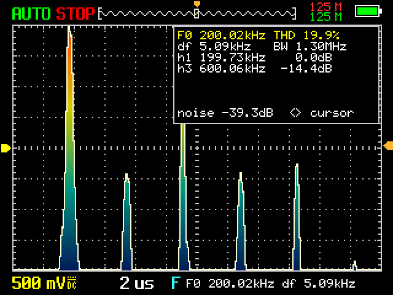
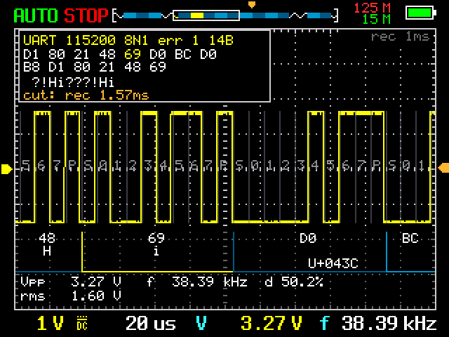
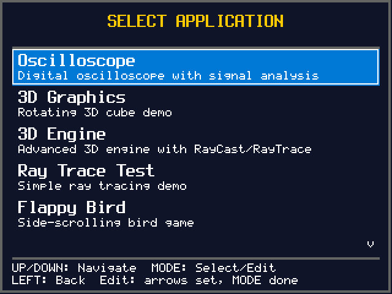
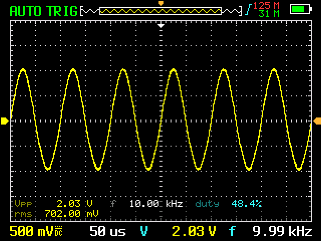
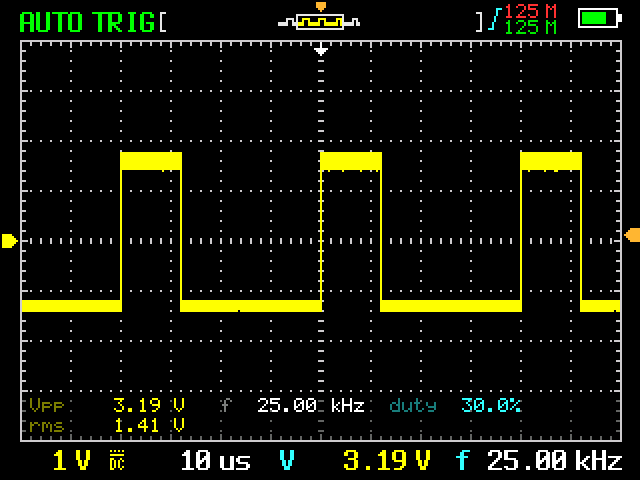
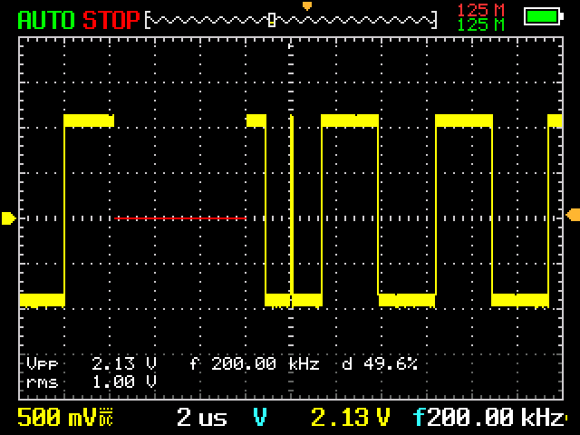
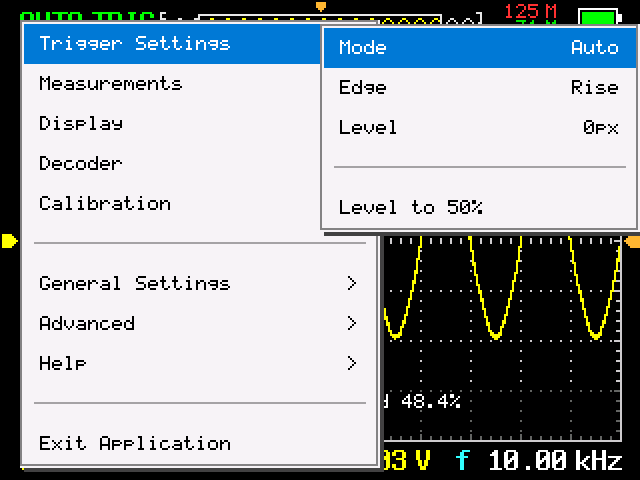
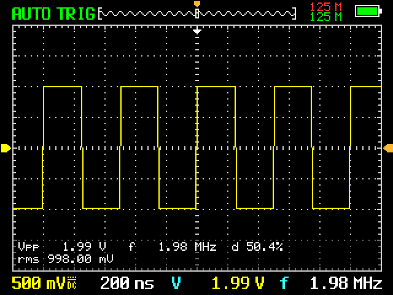
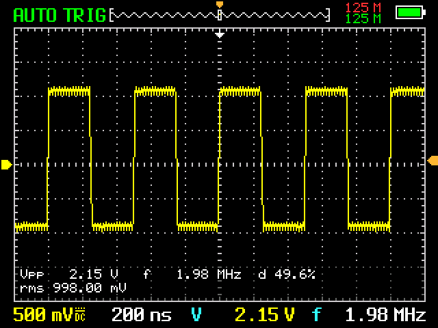
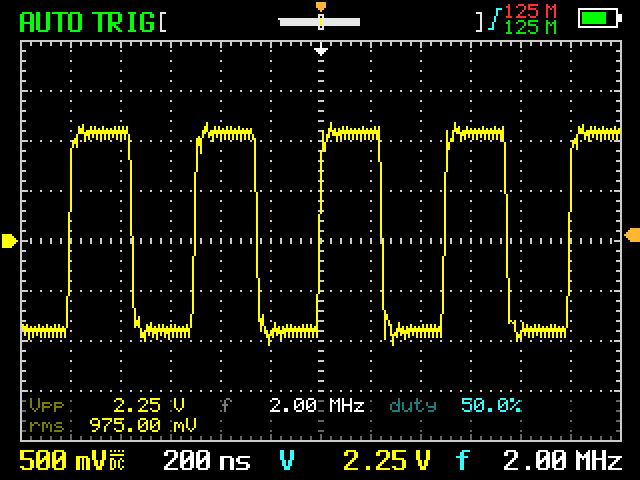

# fun-open-5012h — открытая прошивка для FNIRSI-5012H


[](https://github.com/niazlv/fun-open-5012h/actions/workflows/build.yml)

Прошивка для карманного осциллографа FNIRSI-5012H (GD32F407VE, LCD 320x240) —
[форк](#происхождение) открытой прошивки Алекса Тарадова. Всё, что написано
ниже, можно проверить, не имея прибора: он [эмулируется целиком](#эмулятор-железа),
алгоритмы покрыты [хостовыми тестами](#сборка), а скриншоты не сняты с экрана —
они сгенерированы из того же образа, что заливается в железку.

## Оглавление

- **Начать отсюда**
  - [Чем это интересно](#чем-это-интересно) — пять вещей, ради которых стоит листать дальше
  - [Что умеет](#что-умеет) — одна таблица, весь список
  - [Скриншоты](#скриншоты) — спектр, декодер, входной тракт, меню
  - [Что это за прибор и в чём он врёт](#что-это-за-прибор-и-в-чём-он-врёт) — предыстория железки
- **Пользоваться**
  - [Управление](#управление) · [Особенности](#особенности)
  - [Доступные приложения](#доступные-приложения): [осциллограф](#1-oscilloscope) ·
    [3D](#2-3d-graphics) · [движок](#3-3d-engine) · [трассировщик](#4-ray-trace-test) ·
    [Flappy](#5-flappy-bird) · [Snake](#6-snake-game) · [2048](#7-2048) ·
    [Тетрис](#8-tetris) · [DOOM](#9-doom) · [БК-0010-01](#10-бк-0010-01) ·
    [дампы](#11-coredump-viewer) · [flash](#12-flash-viewer)
- **Как это сделано**
  - [Эмулятор железа](#эмулятор-железа) — Unicorn, модели периферии, модель тракта
  - [Архитектура](#архитектура) — стек экранов, виджет меню, как добавить приложение
  - [Структура проекта](#структура-проекта) — что в каком каталоге и почему
- **Собрать и залить**
  - [Сборка](#сборка) · [Готовые сборки](#готовые-сборки) · [Прошивка](#прошивка) ·
    [Что нельзя стирать](#что-нельзя-стирать)
  - [Пошагово, с нуля](doc/flashing.md) — где взять образ, программатор,
    три провода, дамп 512 КБ, откат
  - [Отладка в VS Code](#отладка-в-vs-code)
- **Справочное**
  - [Иглы на трассе: что это было](#иглы-на-трассе-что-это-было) — разбор дефекта
    захвата: как выглядел, почему, чем починили и где предел шума
  - [Счётчик частоты и стенка Найквиста](#счётчик-частоты-и-стенка-найквиста) —
    как 50.000 МГц читались ровно как 25.000 и почему свёртку не поймать в принципе
  - [Зависание на триггере: что это было](#зависание-на-триггере-что-это-было) —
    вечный цикл внутри обработчика DMA, ждавший момента, который уже прошёл
  - [Технические характеристики](#технические-характеристики) · [Оптимизации](#оптимизации)
  - [Происхождение](#происхождение) · [Лицензия](#лицензия)

Отдельными файлами: [все декодеры подробно](doc/decoders.md) ·
[эмулятор](emu/README.md) · [плата](doc/Hardware.md) ·
[как прошить и снять дамп — с нуля](doc/flashing.md) ·
[распайка программатора](doc/Programming.md) · [что лежит в attic](attic/README.md)

## Чем это интересно

**Эмулятор всей платы.** [`emu/`](emu/) исполняет тот самый `open-5012h.bin`,
который заливается в прибор: Unicorn крутит код, вокруг — модели GD32F407,
AD9288, ST7789, кнопочных шифраторов и батареи. Исходники прошивки про
эмулятор не знают, граница — регистры и выводы. Сигнал на входе и
несовершенства тракта (полоса, выброс, апертурный джиттер, DNL АЦП) задаются
с командной строки, прогоны детерминированы.

**Двадцать четыре протокольных декодера по одному щупу**, двадцать три опознают
протокол сами — в том числе те, что умеют себя проверить: CAN по сошедшемуся
CRC-15, SWD по шести проверкам внутри пакета, USB по CRC5/CRC16 пакета,
USB Power Delivery по CRC32 сообщения, 1-Wire по CRC8 у ROM. Двадцать
четвёртый — SPI без такта — берётся только вручную и прямо называет свои
допущения.

**1537 хостовых проверок** DSP и декодеров: `make test`, без прибора и без
ARM-тулчейна. Список декодеров в тестах — вайлдкард, поэтому новый попадает
под них в день, когда его написали.

**Три дефекта, которые прибор переживал молча** — [и почему он молчал](#что-это-за-прибор-и-в-чём-он-врёт).
Такты ожидания флеша не были выставлены вовсе; CRC записи конфига считался по
диапазону, включающему само поле CRC; хранилище конфига перекрывало хвост
образа. Каждый выглядел как «настройки почему-то слетели».

**Рендерер id Software на настоящем уровне из WAD** — не рейкастер по сетке:
обход BSP-дерева, visplanes, перспективная развёртка текстур и оригинальные
colormap'ы. Все таблицы проекции считаются на хосте, рабочий набор уложен в
120 КБ SRAM, оставшихся от кольца захвата. Текстуры не влезают в образ и живут
на внешней 8-МБ флешке, откуда вычитываются по колонке — [что это стоит по
кадрам](#9-doom).

Всё запускается из общего лаунчера, переключается на ходу и не мешает друг
другу: пока идёт игра, осциллограф остановлен и отдаёт ей свою память.

## Что умеет

| | |
| --- | --- |
| **Осциллограф** | 50 нс/дел … 50 с/дел (медленнее 500 мс — самописец), 50 мВ/дел … 10 В/дел, до 125 Мвыб/с |
| **Измерения** | Vpp, Vp/Vmax/Vmin (от земли), амплитуда по плоским уровням, частота (счётчиком и по спектру — независимо), кандидат сверх Найквиста, период T и полупериоды T+/T−, скважность, Vrms, Vavg, тип сигнала, КНИ, джиттер |
| **Как их видно** | полоса внизу или **виджеты, расставленные вручную** в редакторе раскладки; шрифт и фон панели, два крупных слота в статусной строке |
| **Спектр** | FFT с поиском основной частоты по гребёнке гармоник |
| **Декодеры** | UART, MIDI, CAN, CAN FD, LIN, SENT, 1-Wire (DS18B20), DHT11/22, WS2812, NEC IR, Sony SIRC, EV1527/PT2262, DShot, SPI! (по одному щупу, вручную), SWO/ITM, SWD, USB LS/FS, USB Power Delivery, Manchester, RC5/RC6, DALI, KNX TP1, Servo PWM, CPPM, сырые уровни, автоопределение — [как устроен каждый](doc/decoders.md) |
| **Отладка** | дампы при Hard Fault, просмотрщик flash, авто-открытие дампа |
| **Игры и 3D** | DOOM, Flappy Bird, Snake, 2048, тетрис, куб, RayCast/RayTrace-движок |

## Скриншоты

Сняты с [эмулятора](emu/), исполняющего тот же `open-5012h.bin`, что
заливается в прибор; кадр — то, что прошивка вывела на шину дисплея. Сигнал
на входе синтезированный, числа на экране считает сама прошивка.

### Спектр (FFT)

Меандр 200 кГц. F0 найден по гребёнке гармоник: 200.02 кГц, THD 19.9%,
шумовая полка −39 дБ.



### Декодер протоколов

`Hiмир!` в 8N1 @ 115200, кадр на стыке ASCII и UTF-8: `48`/`H` и `69`/`i` с
символьными подписями, следом двухбайтовая последовательность `D0 BC` →
`U+043C`. Каждый байт подписан под трассой, сетка битов — на самой
осциллограмме. Протокол и скорость определены автоматически; кадр,
разрезанный краем записи, честно посчитан ошибкой (`err 1`).



<details>
<summary>Лаунчер</summary>



</details>

<details>
<summary>Синус 10 кГц после AUTO</summary>

Задано 2 Vpp / 10 кГц, измерено 2.03 В / 9.99 кГц, RMS 702 мВ (теория 707).
Масштаб 500 мВ/дел, 50 мкс/дел подобран кнопкой `AUTO`.



</details>

<details>
<summary>Меандр 25 кГц, скважность 30%</summary>

Измерено 25.00 кГц, d 30.0%. Скважность считается по всей записи.



</details>

<details>
<summary>Поиск глитча</summary>

Меандр 200 кГц с выбросом 80 нс раз в 32 периода. `SHIFT+50%` нашёл самый
узкий импульс записи, остановил захват и подвёл развёртку.



</details>

<details>
<summary>Меню</summary>

Раздел осциллографа: триггер, измерения, отображение, декодер, калибровка,
спектр. Настройки сохраняются во flash.



</details>

<details>
<summary>Входной тракт: ideal / 100 МГц / 15 МГц</summary>

Один и тот же меандр 2 МГц с нулевым временем фронта на источнике, три
варианта `--afe`.

`--afe ideal` — все несовершенства выключены, Vpp 1.99 В:



Тракт прибора (100 МГц, выброс 4%, шум и DNL АЦП по даташиту AD9288) —
фронты 3.5 нс, выброс поднимает Vpp до 2.15 В:



`--afe "bw=15M overshoot=15"` — полосы не хватает:



</details>

## Особенности

- **Стек экранов** — приложения, меню и диалоги живут на одном стеке; экран,
  закрывший что-то собой, при закрытии сам вызывает перерисовку того, что было
  под ним
- **Один виджет меню** на всю прошивку — меню описываются таблицами `const`
- **У каждого приложения свой раздел системного меню** с настройками и свои
  страницы в общем разделе `Help`
- **Текстовые страницы прокручиваются** — со скроллбаром, разделами и
  переходом по разделам, поэтому у справки нет длины, за которую нельзя
  выходить
- **Единые правила управления** во всех приложениях

## Управление

| Кнопка | Действие |
| --- | --- |
| `UP` / `DOWN` | Навигация |
| `LEFT` / `RIGHT` | Изменение значения, вход в подменю, действия приложения |
| `MODE` | Выбрать / подтвердить; в приложении — его основное действие |
| `MENU` | Системное меню поверх работающего приложения |
| `SHIFT+MENU` | Выход в лаунчер из любого места |

<details>
<summary>Переназначение клавиш: что можно переназначить и чем это ограничено</summary>

`MENU > General Settings > Remap Keys` открывает таблицу: слева физическая
клавиша, справа то, чем она работает. Переключатель в первой строке включает
трансляцию целиком, последняя строка возвращает все клавиши к себе. Раскладка
лежит в `config.key_mapping[]` и сохраняется во флеш, как и прочие настройки.

Переназначаются одиннадцать клавиш: `F1` `F2` `SAVE` `AUTO` `AC/DC` `STOP`
`EDGE` `50%` `TRIG` `TRIG_UP` `TRIG_DOWN`. Навигация (`UP` `DOWN` `LEFT`
`RIGHT` `MODE` `MENU` `SHIFT`) — нет, и это не осторожность, а условие
работоспособности: меню ездят на этих клавишах, поэтому никакая раскладка не
может отрезать выход из редактора, который её задал. `1X/10X` в том же списке
защищённых, хотя выглядит обычной клавишей: на плате это и есть `SHIFT` —
один провод (`PE12`) и один бит под двумя именами.

Цель строки ставится двумя способами. `MODE` открывает захват — нажмите ту
клавишу, которой строка должна работать. `LEFT`/`RIGHT` перебирают список,
включая `(off)`: клавиша перестаёт делать что-либо. Перебор здесь не ради
удобства — если клавиша сломана, нажать её в захвате нельзя, а направить на
неё живую можно, и это ровно тот случай, ради которого переназначение и
нужно.

Результат не зависит от порядка таблицы: обмен двух клавиш местами и цепочка
(`F1` на кнопку `F2`, `F2` дальше) дают одно и то же при любом наборе
одновременно нажатых клавиш. Аккорд с системной клавишей тоже переназначается
— `SHIFT+F1` уходит туда же, куда `F1`.

</details>

<details>
<summary>Как собирается системное меню и как читаются текстовые страницы</summary>

Системное меню собирается при открытии: сначала настройки работающего
приложения, затем `General Settings`, `Advanced`, `Help` и
`Exit Application`. Раздел `Help` — единственное место, где живут текстовые
страницы: сначала страницы работающего приложения (у осциллографа — кнопки,
спектр, декодер, калибровка), под разделителем — общие `Key Bindings`.
Пока меню открыто, приложение не выполняется и не рисует.

Внутри текстовой страницы: `UP`/`DOWN` — строка, `LEFT`/`RIGHT` — экран,
`TRIG_UP`/`TRIG_DOWN` — раздел, любая другая кнопка закрывает. Страница,
которая помещается целиком, закрывается любой кнопкой, как и раньше.

</details>

## Доступные приложения

### 1. Oscilloscope

Основное приложение. [Базовая прошивка](#происхождение) даёт сам прибор —
захват, триггер, развёртку, аттенюатор, калибровку. Этот форк добавил поверх
него весь слой анализа, которого в открытой прошивке не было.

**Развёртка и вход**

- 28 шагов развёртки: **50 нс/дел … 50 с/дел**; от 1 с/дел и медленнее луч
  становится самописцем — режим **roll**, описан ниже
- 8 диапазонов по вертикали: **50 мВ/дел … 10 В/дел** (7 транзисторов
  аттенюатора, 50 и 100 мВ отличаются только программным зумом)
- Чередование двух АЦП даёт настоящие **125 Мвыб/с**; кольцо захвата — 96 КБ,
  а экран, измерения, БПФ и декодеры читают его стабильный снимок в 24 КБ
- AC/DC, калибровка нуля и усиления хранятся в конфиге

<details>
<summary>Как дрались за 125 Мвыб/с — и чем эта драка кончилась</summary>

AD9288 — это **два независимых 8-битных преобразователя в одном корпусе**,
у каждого свой такт кодирования (PA8 — АЦП A, PA9 — АЦП B). Здесь оба
тактируются от 62.5 МГц, и единственный способ получить из них 125 Мвыб/с
— развести такты на полпериода. Иначе оба преобразователя защёлкивают
**один и тот же момент**, и каждый 16-битный снимок шины GPIOD несёт одно
мгновение дважды.

Работает это только благодаря одной особенности АЦП: **data align**. Канал
B кодирует на полпериода в стороне, но его выход пересинхронизируется
внутри микросхемы к фронту такта канала A. Шина меняется только по фронтам
A, поэтому одна 16-битная транзакция DMA безопасно уносит оба канала.

В унаследованном коде такты были сведены **в фазу**: одинаковые `CHxCV`,
одинаковый режим PWM, нетронутая полярность. Прибор терял половину
проектной частоты — 50 МГц складывался ровно в 12.5 (= |50 − 62.5|), а на
трассе сидела рябь от отсчёта к отсчёту, потому что дубликат приходил с
другого преобразователя, со своим усилением и своим смещением.

Правка — одна константа: `ADC_B_CLOCK_MODE` с 6 на 7, режим PWM 1 вместо 0
на CH1 таймера. И вот здесь была цена. **Первая попытка инвертировала не тот
канал.** CH0 — это такт канала A, а он опора data align: сдвинув его, мы
сдвинули каждый переход шины на 8 нс прямо на момент защёлкивания DMA. Так
как перекос старта между TIMER0 и TIMER7 — это то, что получится из двух
записей в CEN, каждый `dma_start()` выпадал случайно: то чистый прогон, то
метастабильные нечётные байты — иглы, около 600 мВ мусора на закороченном
входе. Такт канала A двигать нельзя вообще. Инверсия CH1 оставляет тайминги
шины байт в байт такими же, какими они были у всегда работавшей синфазной
сборки.

Дальше по тракту чередование стоит ещё двух вещей. Нечётный байт кольца
приходит с канала A, который **разведён на шину задом наперёд**, — его
разворачивает `buffer_reverse()`, и делать это надо ровно один раз и в
правильный момент (после снятия окна, до публикации записи). А триггер в
двухканальном режиме смотрит только чётные байты: сравнивать перевёрнутые
он не может, поэтому ищет фронт по одной фазе, на 62.5 Мвыб/с, даже когда
запись идёт на 125.

**Чем кончилось.** На эмуляторе всё сходится, но это ничего не доказывает:
[`emu/src/board.c`](emu/src/board.c) зашивает чередование жёстко и режимы
`TIMER0->CHCTL0` не читает вовсе — он выдаст 125 Мвыб/с и синфазной
прошивке тоже. Надпись `125 M` в углу экрана — это `BASE_SAMPLE_RATE`,
константа компиляции: она стоит там независимо от того, что делают такты.
Записанное наблюдение на живом приборе есть **только у неверного варианта**
(те самые иглы); правильный проверяется по списку в комментарии
[`capture.c:105`](src/acq/capture.c#L105) — 50 МГц на вход при 50 нс/дел:
`~50 МГц` значит работает, `~15 МГц` значит пара легла в обратном порядке
(лечится программно), иглы значит плата data align не стратила и надо
вернуть 6/6. Ни один пункт пока не отмечен как увиденный.

</details>

<details>
<summary>Кольцо, снимок и что именно замораживает <code>STOP</code></summary>

Кольцо захвата 96 КБ. Пока идёт захват, всё (экран, измерения, БПФ,
декодеры) читает не кольцо, а его стабильный снимок в 24 КБ — и именно
частота этого снимка определяет, что видно, а что свернётся в алиас:
- до ~16 мкс/дел снимок это **окно кольца на полной частоте**: 24576
  отсчётов подряд, 125 Мвыб/с, Найквист 62.5 МГц
- медленнее — снимок это прореживание всей записи 4:1 (31.25 Мвыб/с,
  Найквист ~15.6 МГц)
- `STOP` замораживает **то, что на экране**: в `Normal`/`Single` кадр
  последнего триггера (снимок) — кольцо к этому моменту уже перезаписано
  тем, что пришло ПОСЛЕ пойманного, и отдавать его значило бы подменить
  улов мусором при первом же зуме. В `Auto`, где экран и так живой,
  достаётся сырое кольцо целиком, если текущий свип успел его обернуть.
  Автостопы (отлов посылки, поиск глитча) всегда берут кольцо — им нужна
  самая длинная история. Пока замороженная запись — только снимок, в
  углу сетки серым написано `rec <длина>`: столько записи есть под зум

Текущая частота снимка показана на экране справа сверху — это она, а не
частота кольца, решает, увидите вы 50 МГц или его алиас

</details>

**Триггер** (`Trigger Settings`)

- Режимы `Auto` / `Normal` / `Single`, фронт `Rise` / `Fall` / `Both`
- Уровень кнопками `TRIG_UP`/`TRIG_DOWN` или из меню
- `50%` — уровень в середину сигнала одной кнопкой
- `AUTO` — автонастройка: вертикаль по длинной записи, частота по диапазонам
  (иначе автонастройка ныряет в милливольты и цепляется за шум)

<details>
<summary>Как устроен поиск фронта — 139 инструкций ассемблера и ни одной на C</summary>

Это код Алекса Тарадова, не форка: [`src/acq/trigger.c`](src/acq/trigger.c)
не изменился с первого коммита ни на байт. Разбор здесь потому, что это
самая плотная часть прибора и понять её стоит.

Задача неприятная: фронт надо найти в 96 КБ кольца, которое DMA продолжает
переписывать, и найти быстрее, чем оно перепишется. Шесть подпрограмм —
`Rise` / `Fall` / `Both` × одноканальный / двухканальный режим — написаны
целиком на ассемблере, без вызова C:

| подпрограмма | инструкций |
| --- | --- |
| `trigger_find_rise_single` / `fall_single` | 139 |
| `trigger_find_both_single` | 135 |
| `trigger_find_rise_dual` / `fall_dual` | 141 |
| `trigger_find_both_dual` | 89 |

Все шесть плюс `trigger_set_levels` — 2324 байта кода.

**Четыре отсчёта за инструкцию.** Уровень триггера размножен по всем
четырём байтам слова (`trigger_set_levels`), а сравнение — `uqsub8`,
насыщающее вычитание по байтам из набора SIMD Cortex-M4: одна инструкция
сравнивает сразу четыре отсчёта с четырьмя копиями уровня. Ненулевой байт
результата означает «этот отсчёт перешёл», нулевой — «нет». Ни одной ветки
на отсчёт.

**Горячий цикл — 19 инструкций на 32 отсчёта.** `ldm` забирает восемь слов
одним махом, дальше восемь пар `uqsub8` + `cbnz`, затем `subs`/`bne`. Меньше
0.6 инструкции на отсчёт — с запасом быстрее, чем 125 Мвыб/с, которые
подсовывает DMA. В двухканальном режиме к каждому слову добавляется
`ands #0x00ff00ff` (27 инструкций на 32 байта): нечётные байты кольца
приходят с канала A разведёнными задом наперёд, сравнивать их бессмысленно,
поэтому триггер ищет фронт по одной фазе.

**Три инструкции, чтобы понять, какой из четырёх.** Когда `uqsub8` дал
ненулевой байт, надо узнать его позицию: `rbit`, `clz`, `lsr #3`. Никакого
перебора байтов.

**Почему он не врёт.** Голое сравнение с уровнем сработало бы мгновенно на
сигнале, который уже выше уровня, — и показало бы «фронт» там, где его нет.
Поэтому подпрограмма сначала читает первый отсчёт записи, и если он уже
выше, уходит в отдельный цикл ожидания: пока сигнал не окажется **ниже**
уровня хотя бы на один отсчёт, фронт не ищется вообще. Гистерезис —
`0x03030303`, три кода из 256 на каждый байт, вычитается при взведении и
прибавляется обратно при поиске, поэтому шум на самом уровне не порождает
череду ложных срабатываний. Отдельный кусок разбирает случай, когда спад и
подъём попали в одно и то же 4-байтовое слово.

**Почему код выглядит скопированным.** Восемь одинаковых блоков `41:`…`47:`
и трамплины вроде `59: b 61f` — не небрежность: у `cbnz` дальность прыжка
всего +126 байт, и цель приходится подтаскивать поближе. В исходнике это
прямо помечено комментарием.

</details>

**Измерения** (`MODE`, настройки в `Measurements`)

- Vpp, частота, скважность, Vrms, Vavg, тип сигнала, КНИ (THD)
- **Амплитуды — не только размах.** `Vp` — пик от **земли**, то есть
  `max(|Vmax|, |Vmin|)`, а не половина Vpp: у логической линии 0…3.3 В эти два
  числа различаются вдвое, и на вопрос «сколько вольт на проводе» отвечает
  первое. `Vmax` и `Vmin` показываются по отдельности и со знаком — по какую
  сторону от земли пик, это половина смысла. Вертикальная позиция из них
  вычтена: сдвиньте луч на две клетки, показания не шевельнутся
- **`amp` — не то же, что Vpp,** и разница ровно в выбросе. Vpp — абсолютные
  экстремумы записи, всё вместе с выбросом на фронте и звоном. `amp` — размах
  между **плоскими уровнями** (`Vtop − Vbase`, перцентили 2%/98% гистограммы
  амплитуд), то есть амплитуда меандра так, как её пишут в даташите. На
  эмулированном тракте с выбросом это 2.03 В против 2.01 В, на реальном фронте
  с звоном разойдётся сильнее. Третья величина, `vamp_mv` в коде, не
  показывается вообще: она отбраковывает иглы, а не хвосты распределения, и
  принадлежит автонастройке — той нужно видеть короткую посылку, у которой
  перцентилей нет
- **Период и его половины.** `T` — время одного целого цикла, то самое, чего
  частота есть 1/x, и то, в чём написаны диаграммы в даташитах. `T+` и `T−` —
  сколько цикл проводит выше и ниже среднего уровня. Все три — одно измерение
  с трёх сторон: `T+ + T− = T` точно, а `T+ / T` и **есть** показание
  скважности, так что два числа на одной панели не могут друг другу
  противоречить
- **Частота считается двумя разными приборами, и оба можно показать рядом.**
  `f` — счётчик по пересечениям среднего уровня: разрешение доходит до
  миллионных долей на низких частотах, потому что он меряет время между
  фронтами и усредняет по 128 периодам. `f (spectrum)` — пик БПФ с
  параболической интерполяцией: грубее бина, зато не может **пропустить**
  фронт, которого не искал. Ошибаются они по-разному, и запись, на которой
  они разошлись, — это запись, которую стоит посмотреть ещё раз. Спектр
  берётся с того преобразования, которое и так считается для определения типа
  сигнала, так что второе измерение бесплатно
- `? (above nyquist)` — **чем показание могло бы быть на самом деле, если это
  свёртка.** Оба прибора выше меряют то, что доехало до АЦП, а выше Найквиста
  доезжает не то, что подали: 108 МГц на 125 Мвыб/с читаются как 17 МГц, и по
  одной записи это неотличимо от честных 17 МГц с генератора. Метрика
  показывает наименьшего кандидата сверх Найквиста — то самое число, что панель
  спектра печатает как `?1`
- Пустое поле в этой метрике — **тоже ответ**, и это её нормальное состояние.
  Число появляется только пока запись не может исключить показание в полосе.
  Если третья гармоника стоит там, где её может поставить только источник в
  полосе, — показание доказано честным, и подписывать к нему «а может быть
  108 МГц» значит врать. Как это доказывается и где перестаёт работать —
  [ниже](#счётчик-частоты-и-стенка-найквиста)
- Два независимых места, включаются раздельно:
  - `Panel over the trace` — панель поверх луча: две строки, в каждой пары
    «имя — значение» подряд. `Size` выбирает шрифт (6x8 — около шести
    показаний, 8x16 — четыре, но читается со стола), `Background` — фон
    (`Dim` подсвечивает луч сквозь текст, `Solid` — непрозрачная полоса,
    единственный вариант, который держится поверх яркой шумной осциллограммы,
    `None` — только текст). Что не влезло, панель говорит сама: `+3 more`
  - Цвет по роду величины, как в статусной строке: вольты жёлтые, время и
    частота белые, отношения голубые; имена притушены, чтобы глаз падал на
    число. Показание, которого сейчас нет (КНИ без спектра, джиттер без
    периодов), рисуется целиком серым — это ответ «нечего показать», а не шум
  - Значения не «ездят»: ширина каждой величины постоянна, поэтому меняются
    только её собственные цифры. Место пары меняется, лишь когда меняется
    набор
  - `Status line` — два конкретных значения крупным шрифтом внизу: `Left` и
    `Right` выбираются по отдельности, ничего не крутится
- Слот в положении `Off` возвращает своё место статусной строке: фронт и
  уровень триггера, горизонтальная позиция. Оба `Off` — строка полностью
  стоковая
- Уровни берутся по перцентилям и с отбраковкой выбросов, поэтому одиночная
  игла не портит амплитуду

**Что настраивается** — `Menu > Measurements`

| Где | Настройка | Что делает |
| :--- | :--- | :--- |
| `Measurements` | `Show (MODE)` | измерения целиком, тем же, чем и кнопка `MODE` |
| `Panel over the trace` | `Panel` | панель поверх луча: `On` / `Off` |
| | `Layout` | `Band` — полоса внизу; `Widgets` — там, где вы их поставили |
| | `Arrange layout...` | **редактор раскладки**, см. ниже |
| | `Size` | `Small` (6x8, ~6 показаний) / `Large` (8x16, 4) |
| | `Background` | `Dim` / `Solid` / `None` |
| | галочки | какие из 17 величин показывать |
| `Status line` | `Left`, `Right` | что стоит в двух крупных слотах, по отдельности |

**Редактор раскладки** (`Panel over the trace > Arrange layout...`)

Где показанию стоять — вопрос про картинку, а список координат картинкой не
является. Поэтому это не пункты меню, а экран: область луча остаётся областью
луча, показания остаются на ней, и их двигают стрелками.

| Клавиша | Что делает |
| :--- | :--- |
| `←` `→` | выбрать показание (обводится рамкой) |
| `↑` `↓` | какая это величина |
| `MODE` | взять / положить; пока держите — стрелки двигают его по сетке 4 px |
| `F1` | размер этого показания: 6x8 ↔ 8x16 |
| `EDGE` | добавить (появляется слева сверху и сразу «в руке») |
| `50%` | удалить |
| `AUTO` | разложить всё как полосу — отмена неудачной расстановки |
| `SAVE` | выйти |

Выход на `SAVE`, а не `MENU`: `MENU` забирает себе лаунчер под системное меню
ещё до приложения, так что до редактора он не доходит. Открыть меню поверх
редактора можно — закрытие вернёт вас в него.

Фон в редакторе — **мок**: меандр 10 кГц и фиксированный набор значений
(2.00 В, 50.0%, 100.00 мкс). Раскладывать против прыгающих цифр — или против
щупа, на котором ничего нет и половина показаний серые прочерки, — значит
раскладывать наугад. А вот рисование не мокается: виджеты идут через тот же
композитор столбцов, которым будут нарисованы потом, поэтому редактор не может
польстить результату.

Раскладка (до 10 показаний: величина, позиция, размер) живёт в настройках и
переживает выключение. Полоса при этом никуда не девается — `Layout` возвращает
её в одно нажатие, и обе раскладки помнят своё.

**Спектр** (`SHIFT+MODE`)

- БПФ по всей записи; разрешение `df = 1/время записи`, то есть его задаёт
  **развёртка**, а не частота дискретизации — 50 и 100 Гц сети разделяются
  только на 5 мс/дел и медленнее
- Основная частота определяется по гребёнке гармоник, а не по самому
  высокому пику: сеть читается как 50 Гц даже когда третья гармоника выше
- Курсор, переход по пикам, управление шириной обзора

**Roll — самописец на медленных развёртках** (сам собой, от 1 с/дел)

- Луч перестаёт быть развёрткой и становится лентой: правый столбец — это
  «сейчас», всё остальное на столбец старше. В слоте состояния вместо
  `WAIT`/`TRIG` горит `ROLL`, поле позиции показывает, сколько времени
  помещается на экране: от **12 с** на 1 с/дел до **10 минут** на 50 с/дел
- `Display > Roll from` опускает границу до 500, 200 или 100 мс/дел —
  туда, где развёртка ещё может, но экран уже стоит секундами
- Каждый столбец — **пиковая огибающая** всех отсчётов за своё время, а не
  одна выборка: на 122 квыб/с в неё попадает и выброс шириной 20 мкс
- Ни одна ручка **не стирает нарисованное**. `SHIFT+U/D` и `UP`/`DOWN`
  пересчитывают историю по вертикали, `SHIFT+L/R` — по времени: медленнее —
  столбцы сливаются, быстрее — один становится несколькими. Частота
  дискретизации в roll не зависит от шага развёртки, поэтому столбец на любом
  из них означает одно и то же и пересчёт законен. Разглядеть в подробностях
  то, что записано грубо, это не даст — несколько новых столбцов несут одну
  огибающую, — но десять минут записи остаются
- Заход в спектр, тренд или декодер ленту тоже **не убивает**: она живёт
  вне столбцов трассы, которые эти виды забирают под себя. Непрерывной её
  при этом никто не изображает — время, проведённое в другом виде, рисуется
  тем разрывом, которым оно и было
- Триггер не участвует; захват на время roll удерживается в `AUTO`, чтобы
  кольцо крутилось, а измерения продолжали приходить. Сохранённый режим
  возвращается на выходе

<details>
<summary>Почему развёртки там нет, а не «не сделали»</summary>

Запись — это всегда 98304 отсчёта, а тактирует их предделитель таймера
шириной 16 бит. Отсюда потолок: самая длинная запись, которую железо может
взять, — около **51 с**, то есть меньше **одного экрана** на 5 с/дел. Никакой
настройкой это не обходится — на медленных развёртках записи просто не
существует.

Но и там, где она ещё существует, ждать её нечем: на 500 мс/дел запись
набирается 6.4 с, и всё это время экран стоит, а потом разом меняется
целиком. Ровно это стоковая прошивка и заменяет самописцем — и ровно поэтому
`Roll from` позволяет опустить границу.

Поэтому roll читает **кольцо на ходу**: `capture_fold_samples()` сворачивает
в пару «мин/макс» всё, что DMA записал с прошлого вызова, без копирования и
без снимка. Позиция записи берётся из регистров самого канала (`MBS` плюс
`CH2CNT`), а не из программных указателей — те верны только внутри
обработчика FTF и снаружи отстают на целый блок. Читать их порознь тоже
нельзя: блок может закончиться между чтением `MBS` и чтением счётчика, и
тогда база старого буфера складывается с полным счётчиком нового — ответ
уезжает на блок в прошлое, а на экране это столбец с сотнями миллисекунд
сигнала в нём, игла во всю высоту сквозь чистую трассу. Счётчик читается по
разу с каждой стороны от адреса, и несовпадение — это ровно та ситуация.

Сама лента живёт в буфере отображения и сдвигается влево на столбец: 300
столбцов min/max уже есть, а второй такой набор — это больше килобайта TCM,
которого свободно около одного. Отсюда и пересчёт истории при смене
вертикали вместо её сброса: строка пикселя знает достаточно, чтобы вернуть
вольты и лечь на новое место.

</details>

**Между выборками** (`Display > Between samples`)

Что рисовать в столбцах, под которыми **нет ни одной выборки** — а на 50 и
100 нс/дел таких три из четырёх, потому что пиксель там короче периода
дискретизации.

- `Lines` (по умолчанию) — прямая от выборки к выборке
- `sin(x)/x` — восстановление по теореме отсчётов. Через набор выборок
  сигнала, ограниченного полосой ниже Найквиста, проходит **ровно одна**
  полосно-ограниченная кривая, и она вычислима точно. То есть это не
  украшательство, а наоборот: изломы на каждой выборке, которые рисуют
  прямые, — как раз выдумка, у аналогового сигнала их нет

Ошибка относительно истинного непрерывного сигнала, замерено на синтетике при
125 Мвыб/с, в отсчётах на размах 200:

| | прямые | `sin(x)/x` |
| --- | --- | --- |
| 12.5 МГц | 4.9 | **0.9** |
| 31.25 МГц | 29.6 | **0.8** |
| 40 МГц | 47.0 | **1.2** |
| 54 МГц | 79.0 | **7.0** |
| 60 МГц | 94.0 | 64.0 |

**Честность режима держится на трёх вещах.**

Восстановленные столбцы всегда рисуются **своим цветом** — зелёным против
жёлтого у настоящих выборок. Видно, где измерено, а где нарисовано, без
подписей.

Ниже **трёх выборок на период** зелёный становится **янтарным**: там ядро
конечной длины перестаёт быть точным (см. таблицу — 54 МГц это 2.31 выборки).
Сама кривая при этом остаётся гладкой и уверенной до самого конца, так что
цвет — единственное предупреждение, которое вообще возможно.

И то, чего режим **не** может: выше Найквиста он нарисует алиас — гладко и
убедительно. Свёрнутые 108 МГц станут безупречной синусоидой 17 МГц. Запись
принципиально не содержит сведений о том, что было выше Найквиста, поэтому
никакой проверки на это в приборе нет и быть не может — см.
[отдельный разбор](#счётчик-частоты-и-стенка-найквиста).

Практическое правило то же, что в мануалах больших приборов: **гладкое —
`sin(x)/x`, фронты — `Lines`.** На фронте, который быстрее шага выборки,
восстановление дорисует звон Гиббса (10–13% выброса на меандре, если фронтенд
пропускает гармоники до Найквиста), которого в схеме нет. Примета —
**провал перед фронтом**: причинная схема звонить до события не умеет.

Измерения режим не трогает вообще: они считаются по сырому кольцу.

**Послесвечение** (`Display > Persistence`)

- `Off` — обычная трасса
- `Infinite` — огибающая копится и **не уходит**, и рисуется **областью**:
  рант, мигнувший один раз полчаса назад, — заметное пятно, а не волосок.
  Ровно то, ради чего накопление и нужно, когда ищешь редкое событие
- `Decay (CRT)` — та же огибающая, но рисуется **двумя кривыми**, верхней и
  нижней, а не заливкой между ними. Это и есть след луча: на сдвиге сигнала
  видно форму старой осциллограммы, которая тускнеет и подтягивается к
  новой. Яркость кончается за ~1.5 с и намеренно ниже цвета луча — луч
  должен оставаться самым ярким на сетке
  - на ровной трассе след прячется под ней и не мешает
  - на шумной — читается как естественное утолщение по шуму
  - каждый столбец дотягивается до половины пути к соседям: без этого на
    крутом фронте, где край огибающей за столбец уезжает далеко, получалась
    не кривая, а пунктир из точек

<details>
<summary>Почему это по столбцам, а не по пикселям, и что из этого следует</summary>

Настоящий люминофор гаснет **попиксельно**. Экран — 300x200, то есть 60000
ячеек: даже по 4 бита это 30 КБ, а свободного TCM над резервом стека — меньше
килобайта. Поэтому яркость одна на столбец, и накопитель — та же пара min/max,
что и раньше, плюс байт, который и так тратился на флаг «в этом столбце
что-то есть».

Отсюда одно правило, на котором всё держится: свечение обновляется **только
там, где огибающая выросла**, а не там, где просто прошла трасса. Иначе
каждый столбец с живой трассой был бы вечно на полной яркости — то есть это
снова `Infinite`, только сложнее. При таком правиле ровная трасса перестаёт
подсвечивать свой столбец сразу, и её собственная огибающая гаснет прямо под
ней, а вспышка, дотянувшаяся дальше, загорается и уходит.

Одного затухания яркости мало: столбец, который вырос хоть на пиксель,
прибит к полной яркости, а на крутом фронте это почти каждый кадр — пиксель
джиттера триггера двигает полосу постоянно. Прибитой оказывалась **вся**
накопленная полоса, включая след минутной давности. Поэтому края ещё и
подтягиваются к живой трассе, каждый сам по себе и только тот, который в
этом кадре не рос: столбец на фронте зажигает ту сторону, где сейчас луч, и
сбрасывает ту, которую покинул.

Первая версия при этом **заливала** всё между краями, и выходил не след, а
сплошной оливковый многоугольник: на крутом фронте, где джиттер триггера
честно раздвигает огибающую на пол-экрана, заливка занимала треть сетки и
светилась почти как луч. Поэтому в режиме затухания рисуются только сами
края — та самая пара кривых, которую луч и оставил бы. `Infinite` заливку
сохранил: там вопрос другой, «где сигнал вообще когда-либо был», и площадь
на него отвечает лучше, чем контур.

</details>

**Декодеры** (`SHIFT+EDGE`, настройки в `Decoder`)

- Автоопределение протокола или ручной выбор
- `TRIG_UP`/`TRIG_DOWN` — переход по байтам, опция остановки на кадре
- До 64 байт в результате; посылка длиннее декодируется настолько,
  насколько влезла в запись, `+` в заголовке панели значит «было больше»
- Байты подписаны **на самом луче**: значение и символ под трассой, поле
  протокола, группы из нескольких байт и сетка бит поверх осциллограммы

| протокол | чем опознаётся | что показывает |
| --- | --- | --- |
| **UART** | перебором скоростей: побеждает та, чьи кадры объясняют запись | текст и UTF-8, ошибки кадра |
| **MIDI** | 31250 бод плюс грамматика статусных байт | `MIDI ch1 On C4 v100`, running status, SysEx |
| **CAN 2.0A/2.0B** | сошедшимся CRC-15; полярность читается с линии | ID, DLC, данные, `ACK`/`NAK` |
| **CAN FD** | сошедшимся CRC-17/21; скорость фазы данных измеряется по записи | `CAN FD 500k/2M 123 12B`, до 64 байт, `FD64`, `EP` |
| **LIN** | брейком в 13 доминантных бит; скорость — из `SYNC 0x55` | `LIN 19200 ID=2A 4B`, `cls`/`enh`, `no resp` |
| **SENT** | sync-импульсом в 56 тиков и ниблами 12…27 тиков | два 12-битных сигнала, CRC |
| **1-Wire** | CRC8 у ROM; 55 семейств Далласа по коду | `DS18B20 +25.06C 12b`, `iButton`, `DS2413` |
| **DHT11 / DHT22** | контрольной суммой пяти байт | `DHT22 45.3% +23.4C` |
| **WS2812** | скважностью бита (28 % и 56 %) | `G0 R0 B0` и цвет пикселя `#221133` |
| **NEC IR** | лидом 9 мс и инверсными байтами | адрес и команда, `cut` у обрезанных |
| **RC5 / RC5X / RC6** | 1.778 мс bi-phase, у RC6 — двойной toggle | адрес, команда, toggle |
| **Sony SIRC** | лидом 4:1 (у RC6 он 3:1) и концом на 12/15/20 битах | адрес и команда, `cut` у обрезанных |
| **EV1527 / PT2262** | sync 1:31 и битом ровно в 4T; PT2262 — парами импульсов | 20 бит адреса + 4 кнопки; `PT 0F1F01FF0011` |
| **DShot** | 16 бит с покоем по краям и CRC4 | газ в процентах, телеметрия, `bd` |
| **Servo PWM** | постоянной каденцией кадра | ширина и угол: `1.75ms +45d 50Hz` |
| **CPPM** | целым кадром: sync, 3…16 каналов, sync | `PPM 8ch 50Hz`, канал как `1.50ms` |
| **SPI!** | ничем — только выбором вручную | битовый поток на названных допущениях |
| **SWO / ITM** | грамматикой пакетов ITM, от 100 кбит | printf прошивки, исключения, `PC=` |
| **SWD** | шестью проверками внутри пакета | `DPIDR`, `CSW`, `TAR`, `ACK`, `par!` |
| **USB LS/FS** | формой SYNC, тетрадой PID и CRC5/CRC16 пакета | `SETUP adr0 ep0`, `DATA0`, `ACK`, `frame 1234` |
| **USB PD** (по CC) | ordered set из K-кодов и CRC32 сообщения | `Src_Cap`, `20.0V 5.0A`, `#4 5.0A`, `2ack`, `req!` |
| **Manchester** | ранами ровно двух длин 1:2, кадр в тишине | биты кадра, `inv`, нарушения `!b15` |
| **DALI** | Manchester 1200 бит/с плюс форма адреса | `DALI a5 lvl 128`, ответ `ans YES` |
| **KNX TP1** | импульсным кодом и чётностью каждого символа | `KNX 1.1.5>1/2/3 1B` |
| **сырые уровни** | — | уровни, длительности, символы |

Как каждый протокол опознаётся, чем подтверждается кадр, что попадает в
подписи и в каком порядке идёт каскад — [`doc/decoders.md`](doc/decoders.md).

**Стоп-режим**

`STOP` замораживает запись, и по ней можно двигаться, менять масштаб,
измерять, декодировать и строить спектр — анализ идёт по сырому кольцу.

Полное описание слоя анализа — в `README_NEW_FEATURES.md`.

### 2. 3D Graphics

Вращающийся куб с заливкой граней и отсечением невидимых поверхностей.
Перерисовывается только та область, через которую куб прошёл.

- `UP`/`DOWN`, `LEFT`/`RIGHT`, `TRIG_UP`/`TRIG_DOWN` — вращение по X, Y, Z
  (любая из них переключает в ручной режим)
- `STOP` — автовращение вкл/выкл
- `MODE` — сбросить вид
- Меню: скорость, стиль (заливка / каркас / оба), сброс вида

### 3. 3D Engine

Движок с режимами RayCast и RayTrace, сценой из кубов, сфер, треугольников
и плоскостей и системой освещения. Кадр строится по две строки за проход
главного цикла и начинается заново при любом движении камеры, поэтому на
экране всегда один целый кадр, а не склейка из двух.

- `UP`/`DOWN` — вперёд/назад, `LEFT`/`RIGHT` — вбок
- `TRIG_UP`/`TRIG_DOWN` — вверх/вниз
- `SHIFT` + стрелки — поворот камеры
- `MODE` — переключить RayCast / RayTrace
- Меню: рендерер, сброс камеры

### 4. Ray Trace Test

Три сферы, трассировка по одной строке за проход главного цикла.

- `LEFT`/`RIGHT` — облёт камерой
- `MODE` — пересчитать кадр
- Меню: разрешение, авто-облёт, `Render now`

### 5. Flappy Bird

Сцена собирается слоями и перерисовывается по частям. `restore_rect()` —
примитив, на котором держится всё остальное: ему дают прямоугольник, он кладёт
обратно небо с градиентом, облака и трубы — именно в этом порядке. Кадр после
этого — полосы, которые трубы освободили, сами трубы, полоса, которую покинула
птица, и один блит 16×16 на неё саму.

Птица составляется поверх того, мимо чего летит: тайл сначала заполняется небом
той полосы градиента, где он оказался, потом колонками трубы, если она за
спиной, и только потом спрайтом. Залить тайл одним цветом — значит пробить
дырку в трубе ровно тогда, когда на птицу смотрят.

Труба рисуется целиком, а не полосой, в которую въехала: затенение поперёк —
то, что делает её трубой, но оно же означает, что двух одинаковых колонок у неё
нет. Обычный трюк со скроллом («дорисовать колонку спереди, стереть сзади»)
оставляет блик там, где он был, и тянет за трубой гребёнку полос.

- `MODE`, `UP` или `STOP` — взмах / старт / переиграть
- Меню: сложность, «Tighten as you score», рестарт, сброс рекорда

Просвет закрывается на 4 px каждые 6 очков, а трубы ускоряются — до шести
ступеней, после чего хватит. Медали на финальной панели: бронза с 10, серебро
с 25, золото с 50; спрайт один, перекрашивается по двум символам палитры.
Рекорд лежит в конфиге и переживает выключение.

### 6. Snake Game

Поле — сетка 20×13 клеток по 16 px поверх шахматной клетчатки. Каждая клетка
собирается в промежуточном буфере 16×16 и уходит на панель одним блитом; за шаг
перерисовываются четыре клетки — освободившийся хвост, новый хвост, голова,
ставшая шеей, и новая голова, — так что цена шага не зависит от длины змейки.

Тело рисуется по маске «какие стороны клетки продолжаются»: прямой участок
читается трубой, поворот — коленом, соседние клетки сходятся без шва. Голова
смотрит туда, куда идёт змейка, хвост сужается к кончику.

Спрайты фруктов и карты уровней лежат в `src/apps/snake_assets.c` текстовой
графикой: символ на пиксель у иконки, символ на клетку у карты. Иконка 16×16
занимает те же 272 байта, что и индексная картинка, но правится прямо в
исходнике — на приборе нет файловой системы, и то, что не вкомпилировано,
не существует.

- Стрелки — направление; нажатия ставятся в очередь, поэтому «влево-вверх»
  между двумя шагами даёт два поворота, а не один и один потерянный
- `MODE` (или `STOP`) — старт / пауза / переиграть уровень
- `SHIFT`+`MODE` — новый заход с первого уровня
- Меню: режим, скорость, переход через стены, бонусный фрукт, рестарт,
  сброс рекорда

**Кампания** — восемь карт: каждая просит на пару фруктов больше предыдущей и
идёт на 10 мс быстрее, а после восьмой начинается заново, ещё быстрее и с
большими нормами. **Классика** — одно открытое поле без конца.

Если край поля убивает, он нарисован: при выключенном переходе через стены игра
сама обводит карту рамкой стен. Невидимая смертельная граница — единственное,
чего игрок не может узнать, глядя на экран.

Золотое яблоко появляется после каждого четвёртого фрукта, стоит 50 очков и
последние три секунды мигает — это решение, а не подарок. Рекорд лежит в
конфиге и переживает выключение.

Логика и отрисовка проверяются на хосте: `make test` гоняет по всем картам
жадного бота, сверяя после каждого шага сетку с телом змейки, и заодно
проверяет, что каждая свободная клетка достижима (иначе фрукт может лечь туда,
куда не доползти) и что ни один блит не вышел за пределы панели — `lcd_draw_buf`
не обрезает, и уехавший блит на железе не пропадает, а рисуется в другом месте.

### 7. 2048

Поле настраивается от 3×3 до 6×6 в меню. Приложение занимает 3.6 КБ и не несёт
ни одного спрайта: плитки — скруглённые прямоугольники из общего тулкита, цифры
— тот же шрифт, что и везде.

Мало кода по двум причинам. В клетке лежит **показатель степени**, а не
значение: 0 — пусто, 11 — плитка 2048. Это байт, это прямой индекс в таблицу
цветов, и «сливаются ли эти двое» превращается в сравнение целых. И сдвиг
**один**, а не четыре: направление — это способ обойти поле, поэтому `cell_at()`
переводит пару (линия, шаг) в клетку, а сам сдвиг никогда не узнаёт, куда его
двигают.

- Стрелки — сдвинуть всё поле
- `MODE` — отменить последний ход (на один шаг)
- `STOP` — новая игра
- Меню: размер поля, новая игра, сброс рекорда

Ход анимируется в два такта: плитки едут туда, где оказались, а потом то, что
из них получилось, вспухает и оседает. Едет не поле целиком — только линии, по
которым что-то двигалось, поэтому кадр анимации стоит нескольких миллисекунд, а
не сорока.

Ход, который ничего не сдвинул и ничего не слил, ходом не считается: новая
плитка за него не появляется. Плитка, только что получившаяся из слияния, в
этом же ходу больше не сливается — ряд из четырёх двоек даёт две четвёрки, а не
восьмёрку. 2048 — веха, а не конец: баннер показывается один раз, игра
продолжается. Числа, которым не хватает места на мелком поле, показываются в
тысячах (`16k`, `64k`).

Правила проверяются на хосте: `make test` разбирает слияния по клеткам на всех
четырёх направлениях и всех четырёх размерах поля, проверяет отмену хода, конец
игры, и что сетка при любом размере укладывается в свою панель.

### 8. Tetris

Экран ландшафтный, а стакан — нет; из этого и вырос макет: стакан 10×20 по 11 px
слева, а справа во всю ширину — панель, которая есть у любого тетриса: next,
hold, счёт, уровень, линии.

Фигура — одно 16-битное число: четыре строки по четыре бита в коробке 4×4, по
числу на поворот, 56 байт на весь набор. Повернуть — взять следующее число,
проверить позицию — пройти шестнадцать бит. Больше ничему в файле не нужно
знать, как выглядит S.

- `LEFT`/`RIGHT` — двигать, `UP` — поворот
- `DOWN` — мягкое падение, 1 очко за клетку
- `MODE` — сброс до дна, 2 очка за клетку
- `F1` — отложить фигуру (hold), один раз на фигуру
- `STOP` — пауза
- Меню: стартовый уровень, призрак, новая игра, сброс рекорда

Одна линия — 100, две — 300, три — 500, четыре — 800, всё умножается на уровень:
четыре линии разом стоят вдвое больше четырёх одиночных, и в этом вся игра.
Уровень растёт каждые десять линий.

Фигуры приходят по семь: мешок тасуется и раздаётся целиком, поэтому партия
никогда не решается «палкой, которая не пришла». Приземлившуюся фигуру ещё
момент можно двигать и крутить — это то, что позволяет подсунуть её под навес.
Поворот, который не влезает, сдвигается вбок на пару клеток, прежде чем быть
отклонённым, — иначе фигура у стены просто перестаёт слушаться. Контур под
фигурой показывает, куда она упадёт.

Перерисовываются только изменившиеся клетки: то, что игрок видит, — это стакан
плюс фигура плюс её призрак, собранные в теневую сетку и сравнённые с тем, что
уже на панели. Кадр стоит горсти клеток, а не двухсот.

### 9. DOOM

Не «похожий на DOOM» рейкастер, а рендерер id Software на настоящем уровне из
WAD: обход BSP-дерева, список solidsegs, перспективная развёртка текстур из
`R_StoreWallRange`, visplanes для пола и потолка, оригинальные colormap'ы,
и движение с исходными разгоном, трением и порогом ступеньки в 24 юнита.

- `UP`/`DOWN` — идти вперёд/назад, `LEFT`/`RIGHT` — поворот
- `SHIFT` + `LEFT`/`RIGHT` — шаг вбок, `F2` — бег
- `MODE` — открыть дверь, `STOP` — пауза
- Меню: `Always run`, `Show stats`, `Restart level`

Клавиатура заведена через два приоритетных шифратора, и одновременно видна
только одна кнопка из группы: `LEFT`, `DOWN` и `TRIG` лежат в одной группе,
поэтому модификатор обязан быть на одном из двух пинов, заведённых напрямую —
это `SHIFT` и `F2`. Иначе шаг вбок в одну из сторон недостижим физически.

Экран поделён точно: 200 строк вида, 32 строки полосы статуса из WAD (STBAR
с лицом, панелью оружия и настоящими цифрами Doom) и 8 строк служебной строки
с FPS и координатами. Здоровье, броня и патроны пока постоянные — менять их
нечему, пока нет геймплея.

<details>
<summary><b>Сборка и заливка ассетов</b> — три команды от IWAD до игры</summary>

Уровень, текстуры, палитра и все таблицы проекции считаются на хосте — собрать
их на устройстве не из чего. В репозитории их нет (это содержимое чужого WAD),
поэтому:

```sh
# 1. пакет из любого IWAD: шароварный doom1.wad, полный doom.wad, freedoom1.wad
python3 tools/wadpack.py doom1.wad -o doom/doom_assets.bin --map E1M1 --split
#    -> doom/doom_assets.bin      110 КБ, линкуется в образ
#    -> doom/doom_assets_tex.bin  100 КБ, поедет на SPI-флешку

# 2. прошивка
cd make && make && make prog          # или openocd, см. «Прошивка»

# 3. текстуры на чип: открыть на приборе SPI Flash Loader, затем
./tools/spiflash.py add doom/doom_assets_tex.bin --name doom.tex
```

Имя `doom.tex` обязательно — приложение ищет файл именно по нему. Проверить,
что он на месте: `./tools/spiflash.py ls`.

Без ключа `--split` получится цельный пакет по-старому: он тоже работает, но
целиком линкуется в образ и **не влезает** — вместе с прошивкой это ~552 КБ
при 512 КБ флеша.

Заливка через `SPI Flash Loader` — три секунды. Без него, одним отладчиком,
те же 100 КБ идут около пяти минут (`./tools/spiflash.py write`), зато не
требуют трогать прибор.

</details>

<details>
<summary><b>Чем платим за ассеты на SPI</b> — 20–55 fps вместо ровных 50</summary>

**С паком во flash было ровных ~50 fps. С текстурами на SPI-флешке — от 20 до
55, в зависимости от того, что на экране.** На простых видах цена почти
нулевая, на сложных частота падает вдвое с лишним. Вот из чего это
складывается.

Внешняя флешка не отображена в адресное пространство: у GD32F407 нет блока
QSPI, а EXMC — параллельная шина, чьи выводы заняты ЖК-экраном и АЦП. Значит
указатель в пак не сделать, и каждую колонку текстуры надо **вычитать по
шине** прежде, чем рисовать.

Единица чтения выбрана по замеру ([tests/doom_cache.c](tests/doom_cache.c),
1896 видов E1M1): за 59 374 обращениями к текстурам на кадр стоят всего 557
вызовов `R_DrawColumn`. Проверять кеш на каждое обращение — больше миллисекунды
на кадр только на проверках; на каждую колонку — в сто раз дешевле. Поэтому
кешируются колонки: 64 слота по 128 байт (колонка максимум 70) в памяти,
одолженной у осциллографа. Флэты пола так кешировать нельзя — `R_DrawSpan`
прыгает по ним индексом, а не идёт подряд, — поэтому все 21 КБ грузятся
резидентно при входе в приложение.

Первая работающая версия давала ровные 17–18 fps. Две правки подняли её до
нынешних 20–55, и обе стоит знать, потому что обе — про то, как легко потерять
кратность на ровном месте:

- **индексация кеша.** Слот выбирался как `(offset >> 4) & 63`, а колонки лежат
  в паке через ~64 байта: соседние попадали в слоты через один, и работала
  четверть таблицы. Сдвиг `>> 6` — та же таблица, используемая целиком.
  Померено харнессом по тем же 1896 видам: **270.7 подкачки на кадр против
  164.3**, минус 39%;
- **такт и команда.** Было PCLK/8 = 15.6 МГц с обычным чтением `03h` — вчетверо
  с запасом, потому что `03h` эти чипы рассчитывают на 50–80 МГц. Стало
  Fast Read `0Bh` (с холостым байтом, за который чип успевает выставить данные)
  на PCLK/4 = **31.25 МГц**: команда рассчитана за 100 МГц, так что предел
  теперь контроллер, а не флешка. Ровно вдвое.

Что осталось нетронутым: **DMA на приёме.** Сейчас каждый байт идёт через опрос
флагов в цикле, и на 132 байта подкачки это сотни тактов накладных расходов
поверх самой передачи. DMA снял бы их с процессора целиком, и это следующий
очевидный шаг, если частота кадров окажется важна.

Если нужны ровные 50 без просадок, соберите цельный пакет без `--split` и
уберите что-нибудь другое из образа: с паком во flash рендерер работает по
указателям и никакой шины между ним и текстурами нет. Правда, освобождать
придётся ~100 КБ.

</details>

</details>

<details>
<summary><b>Карта flash</b> — все 512 КБ прошивке, конфиг на внешнем чипе</summary>

Прошивке доступны **все 512 КБ** внутреннего флеша: с 2026-07-29 настройки и
калибровка живут на внешней SPI-флешке (`0x7A0000`), и последний
128-килобайтный сектор МК освободился. Сейчас занято 344 из 512 КБ.

Так было не всегда, и история тут поучительная. Конфиг занимал последние
256 КБ, хвост ассетов DOOM попадал внутрь него: прошивка работала, а
`config_init` затирал собственные данные на первом же сохранении. Тогда
хранилище ужали до одного сектора, а регион в `linker/gd32f407ve.ld` — до
384 КБ, чтобы переполнение было ошибкой сборки. Теперь регион снова 512 КБ,
а ассерт в том же скрипте сверяется с `__store_reserved`, который Makefile
выставляет по `CONFIG_STORE`: 0 для внешнего хранилища, 128 КБ для
внутреннего. Сборка с `CONFIG_STORE=internal` упрётся ровно туда, где
упиралась раньше.

</details>

<details>
<summary><b>Что уже есть и чего ещё нет</b></summary>

Есть: геометрия и текстуры уровня, пол/потолок, небо, затухание света,
прозрачные средние текстуры, столкновения по linedef'ам через blockmap,
двери (`MODE` пускает луч на 64 юнита и открывает ближайшую спецлинию),
полоса статуса.

Пока нет: спрайтов (вещей и монстров), лифтов, переключателей, линий-
триггеров «по проходу», звука. Двери с ключами открываются без ключей —
инвентаря ещё нет. Свободной
памяти в блоке — около 1 КБ из 120 КБ (`doom_mem_t`), так что спрайтам
понадобится пересмотр бюджета; замеры высоких вод по всем массивам печатает
`tests/doom_host.c --sweep`.

</details>

### 10. БК-0010-01

Электроника БК-0010-01 целиком — советская домашняя машина 1985 года:
К1801ВМ1 (а это PDP-11), 32 КБ ОЗУ, 32 КБ ПЗУ, экран из 16 КБ, которые
видеоконтроллер читает напрямую, и пять регистров наверху адресного
пространства на всю остальную периферию.

- `UP` `DOWN` `LEFT` `RIGHT` — стрелки БК (коды 032, 033, 010, 031)
- `MODE` — ВВОД, `F1` — пробел, `AUTO` — табуляция
- `STOP` — клавиша СТОП, `SAVE` — регистры и дизассемблер
- Меню: экран (цвет/ч-б), вписывание 256 строк в 240, скорость, джойстик

Статистика (`Status line`) рисуется в правом поле панели — 32 пикселя, до
которых картинка БК не достаёт, — и ничего у машины не отнимает. В ч-б поля
нет, и там она строкой снизу. Показывает: кадры (50 — успеваем, меньше —
панель не тянет), **kHz** эмулируемого процессора (у настоящего БК — 3000),
перерисованные строки панели и **vs BK** — то же самое кратностью. Последнее
интересно с `Speed: Unlimited`: сколько БК-0010-01 стоит эта железка, одним
числом.

Клавиатура прибора читается через два приоритетных шифратора, и из группы
видна только одна кнопка: `UP` с `RIGHT` вместе не нажать, как и `DOWN` с
`LEFT`. Ни одной игре на БК диагональ не нужна — на самой машине стрелки в
один ряд.

**ПЗУ монитора в репозитории нет и не будет** — это прошивка чужой машины.
Кладём свои на SPI-флешку, и они подхватятся:

```sh
./tools/spiflash.py add bk10mon.rom            # 8 КБ, встаёт на 0100000
./tools/spiflash.py add bk10bas.rom            # Бейсик, встаёт на 0120000
./tools/spiflash.py add boulderdash.bin        # лента, появится в списке
```

Формат `.bin` — тот самый ленточный: два слова заголовка (адрес загрузки и
длина), дальше байты. Список файлов показывается при входе в приложение.

Без монитора запускается **заглушка** из `bk_load.c`: она ставит стек и
регистры экрана так, как их оставляет монитор, наводит все векторы на `RTI`,
чистит экран и передаёт управление загруженной программе. Это не монитор —
`EMT` возвращается, ничего не сделав. Самодостаточной игре хватает, и она
честно об этом говорит, если программа всё-таки позвала прошивку.

<details>
<summary><b>Что именно эмулируется</b> — и что нет</summary>

Процессор — весь базовый набор PDP-11, включая `XOR`, `SOB`, `MARK`, `SXT`,
`MTPS`/`MFPS`, ловушки `EMT`/`TRAP`/`BPT`/`IOT`, T-бит и ошибку шины по
нечётному адресу. **`MUL`, `DIV`, `ASH`, `ASHC` не реализованы, и это не
упрощение**: у К1801ВМ1 их нет, программы для БК умножают сдвигами, и на
живой машине `070000` уходит в ловушку по вектору 010. Здесь — тоже.

Экран: 256×256 в четырёх цветах и 512×256 в ч-б — это выбор смотрящего, а
не режим железа (видеоконтроллер всегда гонит 512 точек и всегда красит
парами бит). Все 16 палитр БК-0011 разобраны, регистр рулонного сдвига
работает, «малый экран» на 64 строки тоже.

Периферия: клавиатура с обоими векторами (060 и 0274) и правильной —
инвертированной — маской прерывания, строка 50 Гц по вектору 0100,
программируемый таймер 0177706–0177712 с предделителем, джойстик на 0177714,
системный регистр 0177716.

Нет: звука, магнитофона, дисковода, БК-0011М с его страничной памятью.
Такты процессора — форма таймингов 1801, а не измеренный кремний, поэтому в
меню есть «Speed»: если игра идёт не в том темпе, её правят там.

256 строк не влезают в 240 точек панели. `Squash` выбрасывает одну строку из
шестнадцати и показывает все — он по умолчанию, потому что игра на БК кладёт
рамку и счёт туда, где у телевизора был оверскан, и `Crop` срезает именно их
(у Boulder Dash — верхнюю и нижнюю стены пещеры). `Crop` держит масштаб и
теряет шестнадцать строк, деля их между верхом и низом (`Top line`).

</details>

<details>
<summary><b>Из чего собран и как собрать поменьше</b></summary>

Всё в `src/bk/`, и всё выключается из `src/bk/bk_config.h`. Замерено —
разница в прошитом образе, всё остальное неподвижно:

| ключ | байт |
| --- | --- |
| `BK_DEBUGGER=0 BK_DISASM=0` | −2800 |
| `BK_VIDEO_DIRTY=0` | −1984, и кадры вместе с ними |
| `BK_CPU_TBIT=0 BK_CPU_BUS_ERROR=0` | −1856 |
| `BK_IO_TIMER=0` | −528 |
| `BK_STUB_ROM=0` | −384, тогда ПЗУ обязательно |
| `BK_STATS=0` | −368 |
| `BK_VIDEO_PALETTES=0` | −192 |
| `BK_VIDEO_MONO=0` / `BK_IO_JOYSTICK=0` | −128 каждый |
| `BK_CPU_EIS=1` | +704 — машина, которой никогда не было |

```sh
cd make && make BK_CFLAGS="-DBK_DISASM=0 -DBK_DEBUGGER=0"
```

Целиком эмулятор — 21 868 байт кода и 164 байта `.bss`; со всеми ключами
выше — 17 564. Сами 64 КБ машины ни в одно из этих чисел не входят: они
живут в SRAM, которую не занимает кольцо захвата, там же, где DOOM держит
свой `doom_mem_t`.

Проверяется на хосте настоящим кодом PDP-11 — `tests/bk_cpu_test.c` собирает
программы вручную в восьмеричном и смотрит, что вышло, включая умножение
сдвигами и запуск через ту самую заглушку ПЗУ: `make test`.

</details>

### 11. CoreDump Viewer

Просмотр дампов, записанных обработчиком Hard Fault и `error()`.
См. `README_NEW_FEATURES.md`.

### 12. Flash Viewer

Hex / ASCII / Layout / Thumb по содержимому внутренней flash.
См. `README_NEW_FEATURES.md`.

## Эмулятор железа

[`emu/`](emu/) — эмулятор прибора: Unicorn (ядро QEMU) исполняет
немодифицированный `open-5012h.bin`, вокруг — модели периферии GD32F407,
AD9288, ST7789, кнопочных шифраторов и батареи. Исходники прошивки про
эмулятор не знают: граница — регистры и выводы, ассемблерные участки
(триггер, децимация) исполняются как есть.

Сигнал на входе и несовершенства тракта (полоса, выброс, джиттер, DNL,
рассогласование каналов АЦП) задаются с командной строки, прогоны
детерминированы. Скриншоты выше — `emu/scripts/screenshots.sh`.

```sh
brew install unicorn sdl2    # apt: libunicorn-dev libsdl2-dev
make -C make && make -C emu && make -C emu run
```

```sh
./emu/build/fun5012h-emu make/build/open-5012h.bin \
    --signal "square f=1M vpp=2 duty=30 rise=5n noise=10m" \
    --afe    "bw=20M overshoot=15"
```

Ключи, форматы сигналов, модель тракта, скрипты и watchdog —
в [`emu/README.md`](emu/README.md).

## Архитектура

<details>
<summary><b>Стек экранов</b> (<code>src/ui/ui.c</code>) — лаунчер, приложение, меню и диалог на одном стеке</summary>

Всё, что занимает экран — лаунчер, работающее приложение, всплывающее меню,
модальный диалог — это экран на одном стеке. Входные события и `tick()`
получает только верхний экран. При снятии экрана всё, что он закрывал,
перерисовывается вызовом `draw(full=true)`, поэтому ни один экран не должен
знать, что находится под ним.

</details>

<details>
<summary><b>Виджет меню</b> (<code>src/ui/menu_widget.c</code>) — таблицы <code>menu_item_t</code> и прокручиваемые текстовые страницы</summary>

Меню описываются таблицами `menu_item_t` (`MI_ACTION`, `MI_SUBMENU`,
`MI_TOGGLE`, `MI_NUMBER`, `MI_CHOICE`, `MI_SEPARATOR`) и рисуются одним
виджетом: навигация, прокрутка, редактирование значений реализованы один раз.
Здесь же живёт `menu_open_info()` — модальная текстовая страница, на которой
построены все справки и информационные диалоги. Страница длиннее экрана
прокручивается: скроллбар показывает, какая её доля видна, а строка,
начинающаяся с `INFO_HEAD`, — заголовок раздела. Он рисуется полосой,
подписывается рядом с заголовком страницы, пока этот раздел на экране, и
служит точкой перехода для `TRIG_UP`/`TRIG_DOWN`. Справка декодера — это
650 строк и два десятка разделов; без прокрутки от неё читался только
первый экран, а без разделов до последнего пришлось бы держать стрелку.

</details>

<details>
<summary><b>Лаунчер</b> (<code>src/ui/launcher.c</code>) — таблица <code>app_desc_t</code></summary>

Таблица `app_desc_t`: имя, описание и указатели `init` / `task` / `buttons` /
`cleanup` / `redraw` / `menu` / `help`. Приложение выполняется как один экран
поверх лаунчера.

</details>

<details>
<summary><b>Системное меню</b> (<code>src/ui/system_menu.c</code>) — как собирается корень и где живёт <code>Help</code></summary>

Собирается при открытии из меню работающего приложения и общих разделов.
Ничего специфичного для конкретного приложения здесь нет: пункты
осциллографа, например, лежат в `src/scope/scope_menu.c` и показываются
только пока работает осциллограф.

Корень выглядит одинаково у любого приложения:

```text
<настройки приложения>       из app_desc_t.menu
------------------
General Settings
Advanced                     Device Info, System Info, Reboot
Help                         <страницы приложения> + Key Bindings
------------------
Exit Application
```

Раздел `Help` — единственное место для страниц, которые только показывают
текст (`info_page_t`). Настройки и справка живут в двух разных таблицах
именно поэтому: `menu` встраивается в корень как настройки приложения,
`help` — в раздел `Help`, поэтому справка любого приложения лежит по одному
и тому же пути `MENU > Help`. Внутри настроек текстовых страниц быть не
должно.

</details>

<details>
<summary><b>Структура приложения</b> — шесть точек входа и два меню</summary>

Каждое приложение предоставляет:

- `init()` — инициализация и первая отрисовка
- `task()` — работа в главном цикле (вызывается только когда приложение
  наверху стека)
- `buttons_handler()` — обработка кнопок
- `cleanup()` — освобождение ресурсов (в том числе `timer_remove()` для
  своих таймеров)
- `redraw()` — полная перерисовка после закрытия наложенного меню
- `const menu_def_t <app>_menu` — свой раздел системного меню (только
  настройки)
- `const menu_def_t <app>_help_menu` — свои текстовые страницы, они попадают
  в общий раздел `Help`

Важное правило: обработчики пунктов меню **не рисуют**. Пока меню открыто,
оно находится поверх приложения; изменения вступают в силу визуально, когда
меню закрывается и вызывается `redraw()`.

</details>

<details>
<summary><b>Добавление нового приложения</b> — четыре шага</summary>

1. Создайте `src/apps/new_app.h` и `src/apps/new_app.c`, реализуйте шесть
   точек входа выше
2. Экспортируйте `extern const menu_def_t new_app_menu;` и
   `extern const menu_def_t new_app_help_menu;` из заголовка
3. Добавьте строку в таблицу `g_apps` в `src/ui/launcher.c`
4. Добавьте `../src/apps/new_app.c` в `SRCS` в `make/Makefile`, в блок
   приложений

Заголовок подключается по короткому имени (`#include "new_app.h"`): в
`make/Makefile` есть по одному `-I` на каталог, поэтому путь в `#include`
писать не нужно.

Раздел меню приложения должен помещаться в `MAIN_APP_BUDGET` строк
(см. `src/ui/system_menu.c`) — всплывающее меню не прокручивается. Более
длинные списки надо раскладывать по подменю, как это сделано у осциллографа.

</details>

## Структура проекта

Исходники разложены по подсистемам — сверху вниз, от железа к приложениям:

```text
src/core/     старт, syscalls, конфиг, таймер, утилиты
src/hal/      то, что трогает регистры: LCD, кнопки, батарея, флеш, ввод
src/acq/      тракт сбора: захват, синхронизация, буфер
src/dsp/      что из выборок считается: измерения, БПФ, классификация, тренд
src/decode/   декодеры протоколов; logic_decode.c — диспетчер остальных
src/ui/       виджеты и экранная обвязка, без логики осциллографа
src/scope/    сам осциллограф
src/apps/     всё, что запускается из лаунчера и не осциллограф
src/bk/       эмулятор БК-0010-01: процессор, шина, экран, загрузчик
src/debug/    посмертный дамп

doom/         вендорённый движок DOOM, под своей COPYING
include/      вендорные CMSIS/GD32 заголовки
linker/       скрипт компоновки
make/         сборка прошивки (arm-none-eabi-gcc)
emu/          хостовый эмулятор: гоняет тот же .bin через Unicorn
tests/        хостовые тесты, без железа и без ARM-тулчейна
tools/        wadpack.py, git-хуки, rtt.tcl
attic/        код, который ни во что не собирается, — см. attic/README.md
```

Каталоги — это указатель для читателя, а не часть графа включений: в
`make/Makefile` есть по одному `-I` на каталог, поэтому заголовок подключается
коротким именем (`#include "measure.h"`), и файл можно перенести, не правя
каждый `#include`. Цена — имена файлов должны быть уникальны на весь проект:
объектные файлы складываются в один плоский `build/`.

## Сборка

Нужен `arm-none-eabi-gcc` (на macOS — `brew install --cask gcc-arm-embedded`)
и `python3` для отчёта о размере.

Из корня репозитория:

```bash
make            # сборка, с DOOM — образ ~468 КБ из 512 КБ
make DOOM=0     # без ассетов DOOM, если пакет не собран — образ ~354 КБ
make DOOM_APP=0 # без DOOM вообще, так собирает CI — образ ~397 КБ
make test       # хостовые тесты: DSP и декодеры, железо не нужно
make emu        # хостовый эмулятор
make clean      # очистка всех трёх сборок
make layout     # что где лежит в образе
make help       # список целей
```

Корневой `Makefile` — тонкий переходник, он только вызывает `make -C`. Каждая
сборка по-прежнему работает и напрямую: `cd make && make` собирает прошивку,
`cd tests && make` гоняет тесты, `cd emu && make` собирает эмулятор.

Пакет ассетов DOOM — это ~208 КБ, и целиком в образ он не помещался: вместе с
прошивкой выходило ~552 КБ при 512 КБ флеша. Теперь он **режется надвое** по
признаку «как к этому обращаются» — подробности в [разделе про
DOOM](#9-doom):

```
на SPI-флешку (doom.tex, 100 КБ)   в образ (110 КБ)
  TEXDATA  колонки стен              таблицы проекции — это математика, а не
  FLATS    текстуры пола и потолка   данные id, они одни для любого WAD
                                     геометрия уровня, каталоги, HUD
```

Поэтому DOOM собирается по умолчанию и флага для него больше нет. Без пакета
(`doom/doom_assets.bin` отсутствует) линкуется пустая заглушка, приложение
запускается и показывает экран с инструкцией. Сам движок в образе всегда.

Единственное исключение — `make DOOM_APP=0`: тогда DOOM не попадает в образ
вовсе, ни приложение, ни движок, ни пункт в меню. Это не для локальных сборок,
а для тех, что раздаются другим людям: ассеты делаются из чужого IWAD и
приложены быть не могут, так что публичная сборка иначе несла бы приложение,
умеющее только сообщить об их отсутствии. Стоит оно 23 КБ образа. Так собирает
[CI](#готовые-сборки).

Результат — `make/build/open-5012h.bin` (и `.hex`, и `.elf` с отладочной
информацией).

### Готовые сборки

Каждый push собирается на GitHub Actions, и `open-5012h.bin` лежит в
артефактах прогона — [вкладка **Actions**](https://github.com/niazlv/fun-open-5012h/actions),
верхний зелёный прогон, блок **Artifacts** внизу страницы. Тулчейн для этого
не нужен, нужен вход в GitHub (артефакты не отдаются анонимно). По тегу `v*`
тот же файл уезжает в [Releases](https://github.com/niazlv/fun-open-5012h/releases),
откуда качается уже без всякого входа.

В этих сборках нет DOOM — см. `DOOM_APP=0` выше. Что делать со скачанным
файлом дальше — [`doc/flashing.md`](doc/flashing.md).

## Прошивка

Разъём USB на приборе — **не USB**: на линиях данных выведены SWDIO/SWCLK,
так что нужен любой SWD-программатор — покупной CMSIS-DAP, WCH-Link в
ARM-режиме или самоделка из Raspberry Pi Pico, Blue Pill, ESP32-S3. Три
провода, корпус вскрывать не надо:

| Пин micro-USB | Здесь это | Цвет в кабеле |
| :---: | :--- | :--- |
| 1 | +5 В, вход зарядки — программатору не нужен | красный |
| 2 (`D−`) | **SWDIO** | белый |
| 3 (`D+`) | **SWCLK** | зелёный |
| 5 | **GND** | чёрный |

**Если это ваш первый раз — [`doc/flashing.md`](doc/flashing.md)**: что купить
или из чего собрать программатор, как спаять кабель, как снять полный дамп
заводской прошивки и как её вернуть, и что делать, если прибор не находится.
Распайка от автора базовой прошивки, с фотографиями — в
[`doc/Programming.md`](doc/Programming.md).

**Режим программирования.** Держите `F2` при включении прибора. Экран
останется тёмным и никак не покажет, что устройство включено — это нормально:
прошивка останавливается до настройки быстрых тактовых, иначе работающий АЦП
мешает SWD. Прибор при этом питается от своей батареи — программатор его не
питает.

**Дамп заводской прошивки снимают до первой записи.** Она нигде не
опубликована, восстановить её будет неоткуда, а стоит это одиннадцати секунд:

```bash
openocd -f interface/cmsis-dap.cfg \
        -c "transport select swd" -c "adapter speed 2000" \
        -f target/stm32f4x.cfg \
        -c "init; halt; dump_image stock-512k.bin 0x08000000 0x80000; resume; shutdown"
```

`0x80000` — это все 512 КБ внутреннего флеша целиком. Файл должен получиться
ровно 524288 байт и не состоять из одних `00`/`ff` — как проверить и что
делать, если стоит защита от чтения, в [`doc/flashing.md`](doc/flashing.md).
Вернуть его на место потом — тем же `program`, что и свою прошивку; что дамп
действительно заливается обратно,
[проверено на приборе](doc/flashing.md#проверено-на-железе).

Резать кабель для этого не обязательно: те же три сигнала есть на любой USB-A
розетке, в которую воткнут штатный кабель прибора (`D−` → SWDIO, `D+` →
SWCLK, `G` → GND). Обычные micro-USB штекеры в утопленный разъём часто не
достают — [подробности и что с этим делать](doc/flashing.md).

<details>
<summary><b>Вариант 1: OpenOCD</b> — любой CMSIS-DAP программатор</summary>

Так прошивался этот проект — программатором WCH-Link в ARM-режиме. GD32F4
шьётся как STM32F4.

```bash
brew install open-ocd

cd make
openocd -f interface/cmsis-dap.cfg \
        -c "transport select swd" -c "adapter speed 2000" \
        -f target/stm32f4x.cfg \
        -c "program build/open-5012h.bin verify reset exit 0x08000000"
```

Должно закончиться `** Verified OK **`. Проверить уже прошитое, ничего не
перезаписывая:

```bash
openocd -f interface/cmsis-dap.cfg -c "transport select swd" \
        -f target/stm32f4x.cfg \
        -c "init; verify_image build/open-5012h.bin 0x08000000 bin; shutdown"
```

Для WCH-Link есть отдельный конфиг `interface/wch-cmsis-dap.cfg`, но обычный
`cmsis-dap.cfg` тоже его находит.

</details>

<details>
<summary><b>Вариант 2: edbg</b> — то, что стоит за <code>make prog</code></summary>

Так это делает `make prog`. `edbg` нет ни в brew, ни в системе по умолчанию —
его надо собрать из исходников
([github.com/ataradov/edbg](https://github.com/ataradov/edbg)):

```bash
git clone https://github.com/ataradov/edbg && cd edbg && make
sudo cp edbg /usr/local/bin/

cd /path/to/project/make && make prog
```

</details>

### Что нельзя стирать

Настройки и **калибровка** с 2026-07-29 живут на внешней SPI-флешке, по
адресу `0x7A0000` — 64 КБ ротации из 8 МБ чипа. Внутренний флеш МК отдан
прошивке целиком, все **512 КБ**. `mass_erase` внутреннего чипа больше
калибровку не теряет, зато её теряет стирание внешнего: `spiflash.py`
отказывается писать выше `0x7A0000` без явного `--unsafe`, и прошивка
отказывает второй раз, уже на приборе.

Резервная копия — `./tools/spiflash.py dump 0x7A0000 65536 cal.bin`. Числа
калибровки дополнительно показывает страница **MENU → Advanced →
Calibration**: флеш для них — кеш, а не единственный экземпляр.

**Верхние 320 КБ чипа (`0x7B0000`…`0x7FFFFF`) не наши.** Полное сканирование
всех 2048 секторов нашло там данные штатной прошивки FNIRSI: двадцать
сохранённых записей по 4 КБ (`0x7BD000`…`0x7CFFFF`, в них отсчёты АЦП) и
несколько структур выше. Что они значат — неизвестно, восстановить их
неоткуда, поэтому туда не пишет никто. Снять с них копию:
`./tools/spiflash.py pull 0x7B0000 327680 stock.bin` (нужен открытый
**SPI Flash Loader**, иначе `dump` тем же диапазоном, только медленно).

<details>
<summary>Зачем переехало и как вернуть обратно</summary>

Внутренний сектор стоил 128 КБ из 384, доступных прошивке — треть бюджета
образа под 416 байт настроек, — и стирался только целиком, останавливая
выборку кода на 1–2 с. Это и был «белый экран сторожевого таймера». На
внешнем чипе та же ротация стирает 4 КБ за ~45 мс.

Цена: калибровка теперь на отдельной микросхеме. Если её нет или она не
отвечает, прошивка читает старый внутренний сектор (он никуда не делся,
пока образ не перевалит за 384 КБ) и говорит об этом в System Information.

Первая загрузка новой прошивки переносит живую запись сама — ничего делать
не надо, в строке `Cfg:` появится `(migrated)`.

Вернуть старое поведение:

```bash
cd make && make CONFIG_STORE=internal
```

Сборка снова упрётся в 384 КБ (линкер проверяет это ассертом, а не молча),
последний сектор снова станет хранилищем. Флаг меняет и код, и границу
образа, поэтому `make` при его смене сам сбрасывает объектные файлы.

</details>

## Отладка в VS Code

<details>
<summary>Расширения, задачи, <code>F5</code>, SVD и что делать, если программатор не находится</summary>

Всё уже настроено в `.vscode/`. Нужны два расширения:

- **cortex-debug** (`marus25.cortex-debug`) — отладка через OpenOCD
- **C/C++** (`ms-vscode.cpptools`) — IntelliSense

Задачи (`Cmd+Shift+P` → `Tasks: Run Task`):

| Задача | Что делает |
| --- | --- |
| `Build embedded project` | `make` в `make/` (она же по `Cmd+Shift+B`) |
| `Clean embedded project` | `make clean` |
| `Flash with OpenOCD` | собрать и прошить через CMSIS-DAP |
| `Flash binary with edbg` | `make prog` |

Отладка — `F5`, конфигурация **Debug (OpenOCD)**: собирает проект, шьёт,
останавливается на `main`. Работают точки останова, пошаговое выполнение,
просмотр переменных и Live Watch (обновление 4 раза в секунду).

Вторая конфигурация — **Attach (OpenOCD, no reset)** — для разбора зависаний.
Она подключается к работающему прибору и останавливает его там, где он
действительно стоит: без сборки, без `monitor reset` и без `runToEntryPoint`.
Разница принципиальная: первая конфигурация **сбрасывает прибор при запуске**,
поэтому зависший прибор, открытый через неё, всегда покажет `PC` на `main` и
нулевые переменные — это состояние сразу после сброса, а не то, что искали.
Как такой след читается — в разборе
[зависания на триггере](#зависание-на-триггере-что-это-было).

Ещё одно, что экономит улики: зависший прибор поднимается **аппаратным
сбросом**, а не снятием питания.

```bash
openocd -f interface/cmsis-dap.cfg -f target/stm32f4x.cfg \
        -c "init" -c "reset halt" -c "resume" -c "shutdown"
```

SRST сохраняет SRAM, поэтому кольцо дампов по `0x2001F400` переживает
восстановление; выключение питания стирает его. И всякий скрипт, который
останавливает ядро, обязан заканчиваться `resume` — иначе прибор остаётся в
halt, что выглядит ровно как то зависание, которое разбирают.

Пути к конфигам OpenOCD заданы относительно его собственного каталога
скриптов (`interface/cmsis-dap.cfg`), поэтому обновление openocd их не ломает.
Просмотр регистров периферии по умолчанию выключен: для него нужен SVD-файл,
которого в репозитории нет. Если нужен — положите `STM32F40x.svd` и добавьте
в `launch.json`:

```json
"svdFile": "${workspaceRoot}/resources/STM32F40x.svd",
```

Если программатор не находится, проверьте, что прибор в режиме
программирования (`F2` при включении) и что `openocd` видит его сам:

```bash
openocd -f interface/cmsis-dap.cfg -c "transport select swd" \
        -f target/stm32f4x.cfg -c "init; shutdown"
```

Должно появиться `Cortex-M4 r0p1 processor detected`.

</details>

## Что это за прибор и в чём он врёт

FNIRSI-5012H — карманный осциллограф из тех, что продаются готовыми
приборами: экран, кнопки, щуп, закрытая прошивка и никакой схемы. Всё, что
известно о плате, известно потому, что Алекс Тарадов её разобрал и записал —
[`doc/Hardware.md`](doc/Hardware.md) целиком его. Открытая прошивка выросла
оттуда, этот форк — из неё.

Прибор при этом устроен так, что несколько вещей в нём не то, чем кажутся.

**Разъём USB — не USB.** На линиях данных выведены SWDIO и SWCLK: это
заводской порт программирования. USB на нём не заработает без переделки
платы. Приятная сторона — прошить прибор можно, ничего не вскрывая; неприятная
— воткнутый кабель не сделает ровно ничего. Что куда паять и чем шить —
[`doc/flashing.md`](doc/flashing.md).

**АЦП — не AD9288.** Микросхема без маркировки, выводы совпадают с AD9288,
но пара ножек, помеченных в оригинале как NC, здесь посажена на землю через
конденсаторы, и метка первого вывода другой формы. Скорее всего клон, возможно
MXT2088. То есть даташит, по которому приходится работать, — не даташит той
детали, которая стоит на плате.

**Диапазона 50 мВ/дел не существует.** 50 и 100 мВ/дел — один и тот же
транзистор аттенюатора (Q3) и одно и то же положение реле. Разница целиком
программная: прошивка домножает. В списке диапазонов их два, в железе —
один.

**Клавиатура физически не берёт часть комбинаций.** 18 кнопок читаются двумя
приоритетными шифраторами SN74HC148 по восемь, и из группы видна ровно одна
нажатая кнопка. `LEFT`, `DOWN` и `TRIG` лежат в одной группе — держать их
вместе нельзя в принципе. Отдельно на ножки МК заведены только `F2` и
`SHIFT`, поэтому все модификаторы в этой прошивке сидят на них: иначе,
например, шаг вбок в DOOM в одну из сторон был бы недостижим.

**И главное — прибор не измеряет собственную частоту дискретизации.**
Надпись `125 M` в углу берётся из `BASE_SAMPLE_RATE` — это `#define`. Ничто
в системе не сверяет её с тем, что реально делают такты АЦП. Именно поэтому
сведённые в фазу такты (см. [`src/acq/capture.c`](src/acq/capture.c) и раздел
[осциллографа](#1-oscilloscope)) прожили так долго: прибор честно показывал
125 Мвыб/с, выдавая 62.5, и единственным симптомом был 50 МГц, свернувшийся
в 12.5 — а кто в такой прибор подаёт 50 МГц.

Тот же узор — у трёх дефектов из начала этого файла. Такты ожидания флеша не
были выставлены вовсе, и настройки просто иногда не сохранялись. CRC записи
конфига считался по диапазону, включающему само поле CRC, и не сходился
никогда — прибор молча возвращался к умолчаниям. Хранилище конфига
перекрывало хвост образа, и прошивка работала ровно до первого сохранения.
Ни одна из трёх поломок ничего не сообщала: она выглядела как «настройки
почему-то слетели».

## Иглы на трассе: что это было

Отдельный разбор, потому что дефект прожил в прошивке долго, маскировался
под «шумит развёртка», и цена ошибки в диагнозе тут выше обычного: сигнал
портился **до** всего, что его читает.

### Как это выглядело

На 200 мкс/дел трасса шла в иглах во всю высоту экрана, и триггер в режиме
NORMAL срабатывал на них постоянно — поймать реальное событие было нельзя.
Величина иглы — около **128 отсчётов** из 256, ровно полшкалы, и она не
менялась при смене аттенюатора: 600 мВ на 100 мВ/дел, 1.05 В на 200 мВ/дел,
то есть одно и то же в отсчётах АЦП. Наводка со входа делилась бы
аттенюатором вместе с сигналом — здесь этого не происходило, а значит
источник лежал уже за ним, в цифре.

Сбивало с толку то, что дефект казался привязанным к развёртке. На самом
деле он был привязан к **частоте дискретизации**: 15.625 Мвыб/с чисто,
31.25 и выше — иглы. Просто на 200 мкс/дел запись прорежена 4:1 и покрывает
всю ширину экрана, поэтому туда попадали разом все иглы записи, а не
несколько.

### Почему

Такты АЦП делает TIMER0, запрос DMA — TIMER7, и оба живут при `CAR = 1`.
Счётчик при этом принимает только 0 или 1, то есть за период есть ровно две
точки, где может сработать сравнение, и `CH0CV` выбирает между ними.

Стояла та, что срабатывает при счёте 1. Это **тот же самый тактовый момент**,
что и фронт кодирования АЦП B, потому что его канал запущен инвертированным
(`ADC_B_CLOCK_MODE = 7`). Иначе говоря, чтение шины было назначено ровно на
тот миг, когда преобразователь выставляет на неё новое значение. Задержка от
запроса до фактического чтения `GPIOD` фиксирована, поэтому чтение стабильно
попадало в момент переключения, и байт возвращался смесью двух соседних
выборок. На главном переносе 127→128, где меняются все восемь бит сразу,
такая смесь даёт ошибку ровно в полшкалы — те самые 128 отсчётов.

Порог по частоте отсюда же: пока период короче задержки чтения, уйти от
перехода некуда.

### Как починили

Двумя шагами, каждый проверен на железе отдельно.

**Шаг 1 — увести чтение с перехода.** `CH0CV = 0` вместо 1: сравнение на
перевороте счётчика, в полупериоде от перехода. Запрос по-прежнему один за
период, частота дискретизации не меняется ни на герц. Какая из двух точек
верна, зависит от **периода** — задержка фиксирована в наносекундах, а
период нет, — поэтому выбор идёт по делителю: короткие периоды берут счёт 1,
длинные переворот.

**Шаг 2 — позиционировать точно.** Две точки — это всё, что может назвать
`CAR = 1`, и лучшая из двух не есть лучшая вообще. Счётчик TIMER7 переведён
на полные 250 МГц, период уехал в `CAR`, и строб стал позиционируемым с шагом
**4 нс**: восемь точек на 200 мкс/дел вместо двух. Запрос остался один за
период — частота не изменилась.

Оптимум пришлось задавать таблицей по делителю: задержка запрос→чтение не
одинакова при 62.5 и 31.25 млн запросов в секунду, и одна общая поправка
чинила 200 мкс ровно ценой 100 мкс.

### Как это померили

Ключевой шаг, без которого перебор был бы гаданием: **иглы считает сам
прибор.** Вход закорочен, режим NORMAL, уровень триггера +300 мВ — это около
64 отсчётов, недосягаемо для фона в 1–2 отсчёта и заведомо ниже иглы в 128.
Прибор стоит в `WAIT` и дёргается только на игле, а «ловлю одну изредка»
превращается в число за 30 секунд.

| делитель | период | точек | поправка 0 | поправка +1 |
| --- | --- | --- | --- | --- |
| sr 1 | 16 нс | 4 | чисто | иглы, >10/с |
| sr 2 | 32 нс | 8 | 19–20 за 30 с | **ни одной** |

Правильная позиция даёт **ноль**, а не «пореже» — именно поэтому таблицу
можно расширять осмысленно.

### Где предел

Осталось то, что дефектом уже не является, и упирается это в разные вещи.

**1–2 отсчёта на медленных развёртках — это квантователь.** АЦП
восьмибитный, один отсчёт равен 1/256 шкалы, и размах в один отсчёт есть
физический пол: измеренные 4 мВ на 50 мВ/дел при 1 мс — это 0.85 отсчёта,
ниже уже нечему быть. Аппаратно не улучшается никак.

**3–4 отсчёта на быстрых — это установление.** Чем короче период, тем меньше
времени на установление шины и тем заметнее апертурный джиттер. Зависимость
монотонная и ровная: 1 мс — 0.85 отсчёта, 500 мкс — 1.9, 100 мкс — 2.7–3.7.
Это характеристика преобразователя, а не ошибка прошивки.

**Рябь на 50 мкс/дел и быстрее — это не шум.** Там работает чередование двух
преобразователей, и видна их взаимная рассогласованность по усилению и
смещению. Она детерминированная, а значит калибруется — см.
`calib_channel_delta` в меню калибровки, а не борьбу с шумом.

Уменьшить оставшееся можно только усреднением, и тут стоит различать два
разных инструмента. Режим усреднения в прошивке (`average_mode`) — это
экспоненциальное среднее по кадрам в пространстве экрана: на быстрых
развёртках, где столбец и есть одна выборка, он даёт учебные √N, но требует
повторяющегося сигнала и устойчивого триггера. На медленных развёртках в
столбец попадает несколько десятков выборок записи (на 200 мкс/дел — 62), но
берётся из них только пара min/max, а усредняется потом лишь середина
полосы. Усреднение **внутри столбца** дало бы там √62 ≈ 8-кратное падение
шума, то есть около трёх дополнительных бит по вертикали, и не требовало бы
ни повторяемости, ни триггера. Ценой пикового детектора: игла уже, чем
столбец, перестала бы быть видна — поэтому это отдельный режим, а не
умолчание. Сейчас его нет.

## Счётчик частоты и стенка Найквиста

Второй разбор в том же жанре, и по той же причине: счётчик врал молча,
уверенно и на самой ходовой частоте, какая бывает.

### Как это выглядело на стенде

На вход подан меандр 54.000 МГц с ПЛИС — точный множитель кварца, без
дробных приближений. Счётчик внизу экрана показывал **56–57 МГц**, а спектр
на панели — **53.99–54.00**. Оба измерения с одной и той же записи.

Расхождение в разные стороны на разных сигналах исключало ошибку
калибровочной константы: та дала бы один знак и один процент. Значит, дело
не в опоре времени, а в детекции фронтов.

### Почему так вышло

Три независимые поломки, и все три видны только выше ~15 МГц.

**Частота бралась как медиана периодов.** Когда сетка выборок не делит период
нацело, интервалы между пересечениями распадаются на два кластера, отстоящих
ровно на одну выборку: при 2.31 выборки на период 68% попадают в «две
выборки» и 32% в «три». Медиана садится **на более населённый кластер**, а не
между ними. Среднее было бы несмещённым — медиана смещена по построению.

**Полоса Шмитта была фиксированные 20% размаха.** А сетка гарантирует провал
под средний уровень только на `(размах/2)·cos(π/N)` при N выборках на период —
это 10.5% при 2.31, вдвое меньше полосы. Треть пересечений просто **не
взводила** триггер, и их не существовало для счётчика. Именно этот дефект и
давал 54 → 58.5, потому что до АЦП доходит синусоида: фронтенд к 162 МГц
третьей гармоники уже ничего не пропускает.

**И тот, ради которого этот раздел написан.** При **ровно 2.5 выборки на
период** арминг детерминированно теряет каждое второе пересечение. 50.000 МГц
читались как **ровно 25.000** — при 128 найденных периодах, `good = 100%` и
периоде в круглые 5 выборок. Ни один показатель качества не дрогнул, в записи
не было ничего, что противоречило бы ответу. А 50 МГц — самый ходовой кварц
на свете, и показание вдвое ниже выглядит абсолютно правдоподобно.

### Чем починили

Медиана осталась, но у неё отобрали работу, для которой она не годится.
Теперь она решает, **какие** интервалы настоящие, а значение — среднее по
ним. Допуск: четверть медианы, но **не меньше одной выборки** — и этот пол
здесь главное, потому что окно в ±25% впускает обратно ровно то же смещение.

Полоса Шмитта ограничена тем, что сетка способна пообещать, а проход
повторяется, если ограничение сработало. Для половинной ловушки полоса
проверяется ещё и на то, чего потребовал бы период **вдвое короче**: если
пересечения там были, второй проход их находит.

### Чем это померили

Синтетика на хосте против истинного сигнала, тот же `measure.c`, что стоит в
приборе. Было → стало:

| | было | стало |
| --- | --- | --- |
| 45 МГц (2.78 выб/период) | −1.23% | **+0.02%** |
| 50 МГц (2.50) | **−50.00%** | **+0.00%** |
| 54 МГц (2.31) | +8.73% | **+0.10%** |
| 60 МГц (2.08) | +3.56% | **+0.06%** |

Проверено на приборе тем же генератором на ПЛИС, с которого началось.

### Где предел теперь

**60 МГц — это 2.08 выборки на период, а стенка Найквиста в двух.** Там
остаётся до +3.4% на слабом сигнале, и лучше не будет: информации в записи
столько и есть.

**Один угол на 50 МГц выжил** — сигнал размахом около 20 отсчётов при почти
нулевом шуме. Гарантированный провал там 3 отсчёта, а после квантования в 8
бит от него не остаётся ничего. Характерно, что чуть шума — и всё считается
верно: шум работает дизером.

**`good_pct` этот угол не ловит**, показывает 100% вместе с неверным
показанием. Как индикатор он ловит дрожание, но не систематический пропуск.

**А свёртку не поймать теми частотами, что прибор использует сейчас.**
Соблазнительная идея — снять запись на двух частотах дискретизации и
посмотреть, уехала ли частота, — на ходовом наборе не работает, и это
доказуемо. Все рабочие частоты есть `125/2^k`, то есть **делят 125 нацело**;
значит 125 — общее кратное любой пары, а отображение `x → 125−x` сохраняет
свёртку при каждой из них. 108 МГц читаются как 17.0 и на 125, и на 62.5, и
на 31.25 Мвыб/с.

По положениям пиков не поможет и ничто другое, и это уже теорема, а не
свойство набора. Если `f = n·Fs ± a`, то `k·f = k·n·Fs ± k·a`, а `k·n·Fs`
равно нулю по модулю `Fs`: **каждая гармоника каждого кандидата сворачивается
туда же, куда гармоника любого другого**. Прореживание тоже бесполезно:
`Fs' = Fs/M` делит `Fs`, так что неразличимое при `Fs` остаётся неразличимым
при `Fs'`. Это проверяется тестом — спектры 17 МГц и 108 МГц при 125 Мвыб/с
совпадают бин в бин, с невязкой 0.000%.

### Чем это всё-таки развязывается

Тем, что интерливинг **удваивает** частоту дискретизации относительно такта
кодирования, а удвоенная тройка из 125 уже не выходит.

`TIMER0` с `CAR = 1` даёт каждому конвертеру `125/(PSC+1)` МГц, а два
конвертера в противофазе дают запись вдвое чаще: `Fs = 250/(PSC+1)`. При
`PSC = 1` это привычные 125 Мвыб/с. При **`PSC = 2` это 83.33 Мвыб/с** — и
125 на 83.33 нацело не делится, так что вложенности наборов больше нет:

| f₀ | при 125 Мвыб/с | при 83.33 Мвыб/с |
| --- | --- | --- |
| 17 МГц | 17.0 | 17.0 |
| 108 МГц | 17.0 | **24.67** |

Однозначность держится до 125 МГц; выше остаётся зеркало `f ↔ 250−f`
(108 и 142 неразделимы и этой парой). ФАПЧ трогать не нужно, скважность
кодирующего такта остаётся ровно 50%, интерлив на полпериода не ломается —
меняется одно значение прескалера в `TIMER0` и `TIMER7`.

Что за это придётся заплатить: `g_strobe_trim[]` в
[capture.c](src/acq/capture.c) индексируется по `sr_divider` и откалиброван
только под текущие степени двойки. Новый период — новая позиция строба, а
неверная даёт те самые иголки. Процедура измерения расписана там же в
комментарии, и **пока она не проделана на стенде, эта частота в прошивку не
заведена**: прибор, врущий по-новому, хуже прибора, который честно говорит
«не знаю».

### Что прибор говорит сейчас

Пока второй частоты нет, спектр отвечает тем, что у него есть — гармониками.
Асимметрия здесь одна, и её достаточно. Источник с резкими фронтами на
частоте `f` ставит h3 на `3f`. Если `f` в полосе, то `3f` не выше трёх
Найквистов и тракт что-то пропускает. Если `f` — алиас, то самое низкое, чем
он может быть, это `Fs − a`, и его h3 начинается с `3·(Fs − a)`, втрое дальше
края полосы, где не выживает ничего. **Видимая h3 — свидетельство, которое
может дать только сигнал в полосе.**

Обратное неверно, и панель это признаёт: отсутствие h3 одинаково объясняется
честной синусоидой ниже Найквиста и меандром выше него. Тогда `F0` получает
знак вопроса, а под списком пиков выписывается лестница `n·Fs ± a` —
кандидаты, а не одно число.

Нижняя ступень этой лестницы, `?1`, выведена и отдельной метрикой —
`? (above nyquist)` в [измерениях](#1-oscilloscope), так что кандидата видно
и в обычной развёртке, не открывая спектр. Считается она не с той записи, что
рисует спектр, а с того же непрорежённого преобразования, что и тип сигнала:
прорежённый спектр отвечать на этот вопрос не вправе, потому что край полосы
там задаёт цифровой фильтр прореживания, а не аналоговый тракт. Пустое поле у
метрики означает ровно то же, что отсутствие знака вопроса у `F0` — вопрос
либо снят, либо не задан.

Отдельно важно, чего **не** проверяется. Тест отказывается отвечать там, где
ответ был бы угадыванием:

- `3f` за полосой тракта — h3 нет по причине, не связанной с показанием
  (иначе честный меандр 50 МГц объявлялся бы алиасом);
- свёртка кладёт h3 на DC или на саму основную. При `f = Fs/4` **все**
  нечётные гармоники сворачиваются на основную, при `f = Fs/3` — на DC или на
  основную. Оба случая — честные меандры в полосе, и наивная проверка «нет h3
  → алиас» объявляет алиасом оба;
- шумовой пол выше уровня решения.

И чего проверка **не** использует: похожа ли запись на меандр. Алиасный
меандр приходит голой синусоидой — гармоники, делавшие его меандром, тракт и
съел, — так что гейт по времянке отбраковывал бы ровно тот случай, ради
которого всё это написано.

Порог один: h3 слабее −30 дБ относительно основной не объясняется резкими
фронтами в полосе. Он держится на том, где тракт умирает, и это единственное
число, которым модуль откалиброван — `ALIAS_FRONTEND_HZ` в
[alias.h](src/dsp/alias.h). Одна точка со стенда уже есть: меандр 25 МГц дал
h3 на −22.9 дБ вместо −9.54, то есть на 75 МГц тракт уже на 13.4 дБ ниже.

Поэтому спектр и выведен отдельным измерением рядом со счётчиком: два разных
прибора, ошибающихся по-разному, — это всё, что тут можно противопоставить,
пока вторая частота дискретизации не снята на стенде.

## Зависание на триггере: что это было

Прибор вставал намертво: экран застывал на последнем кадре, подсветка горела,
ни одна кнопка не отвечала, экран HARD FAULT не появлялся. Лечилось только
снятием питания.

### Как оно проявлялось

Условия воспроизведения набирались долго, потому что каждое по отдельности
выглядело несущественным:

- вход 54–108 МГц, быстрая развёртка;
- **включена AC-связь** — с DC и смещением не воспроизводилось;
- большая амплитуда — на ~50 мВ не рвало;
- включено усреднение;
- срабатывало **в момент, когда трасса подходила к триггеру**.

Сбивало с толку то, что отладчик показывал `PC` на `main` и все переменные
нулями. Это оказалось артефактом инструмента: конфигурация **Debug (OpenOCD)**
— это `request: launch` с `runToEntryPoint: main` и `monitor reset`, то есть
запуск сессии **сбрасывал прибор и стирал состояние раньше, чем на него
посмотрят**. Нулевые переменные — просто свежеочищенный `.bss` до первой
исполненной строки. Ради таких случаев рядом появилась конфигурация
**Attach (OpenOCD, no reset)**.

Подключение без сброса дало ответ сразу:

```text
current mode: Handler External Interrupt(58)
xPSR: 0x2105004a   pc: 0x0800672e
```

IRQ 58 — это `DMA1_Channel2_IRQn`. Ядро стояло внутри обработчика прерывания
захвата, в `dma_wait_count()` ([capture.c](src/acq/capture.c)).

### Почему цикл не заканчивался

Канал DMA работает с двойной буферизацией (`SBMEN`): `CH2CNT` считает вниз и
**в конце каждого буфера перезаряжается** на полный размер. Ожидание хвоста
записи после триггера было написано так:

```c
while (DMA1->CH2CNT > count);
```

Оно ждёт, пока счётчик окажется в окне `[0, count]`. Окно открывается и
закрывается один раз за буфер, и цикл молча предполагал, что опрос не может
через него перешагнуть.

Может. Чтение `CH2CNT` — обращение по AHB ценой в десятки тактов ядра, а
преобразователь двигает счётчик каждые 8 нс: между двумя соседними опросами
проходит N ≈ 5–10 передач. Попадание гарантировано, только пока `N ≤ count+1`.
Если `count` меньше — опрос перепрыгивает с «больше count» сразу на
перезаряженное значение, ждёт ещё один буфер и промахивается снова. И так
вечно, **внутри обработчика прерывания**: ядро из него не выходит, а
тактирование, периферия и панель при этом живы. Поэтому это не краш, а именно
зависание, и поэтому HARD FAULT не показывался — фолта не было.

Насколько мал `count` — решает `g_remaining`, то есть **куда попал триггер**.
Отсюда и вся коллекция условий: AC-связь центрирует сигнал так, что он
начинает пересекать уровень триггера, большая амплитуда обеспечивает те же
пересечения, а на 50 мВ с постоянной составляющей их могло не быть вовсе — и
ветка просто не бралась.

### Чем это лечится

Цикл получил два дополнительных выхода вместо единственного. Главный —
**обнаружение перезарядки**: если счётчик пошёл ВВЕРХ, нужный момент уже
прошёл, и ждать его повторно бессмысленно. Второй — предел числа опросов, на
случай если DMA перестанет двигаться совсем; он стоит на порядок выше худшего
законного ожидания (один буфер на самой медленной развёртке, ~17 мс).

### Что это стоит

Почти ничего, и это следует из самого условия промаха. Промах возможен только
при малом `count`, а выйдя по перезарядке, мы захватываем лишнего порядка
`count + N` передач — **10–20 отсчётов, то есть 100–300 нс**. При записи в
96 K отсчётов это 0.02–0.04%, то есть сдвиг, которого на экране не существует.

Когда окно поймано — а это штатный случай — цикл выходит ровно там же, где
выходил раньше. Погрешность ±N передач в нём была и до правки: он всегда
останавливался на первом *увиденном* значении `≤ count`, а увидеть мог
`count - N`.

### Чего это не закрывает

Без изменений остались `while (DMA1->CH2CTL_b.CHEN);` в `dma_stop()` и четыре
ожидания тактов в заинлайненном `sys_init()`. Ни одно из них не было причиной
этого дефекта, но предела у них по-прежнему нет, а сторожевого таймера в
прошивке нет вообще — так что любое оставшееся зависание останется вечным.

## Технические характеристики

- **Микроконтроллер**: GD32F407VE (ARM Cortex-M4F), разогнан до **250 МГц**
  при штатных 168 — с включением high-drive по процедуре вендора и
  безопасным откатом, если кристалл не подтвердит готовность
- **Память**: 512 КБ flash — вся прошивке, настройки уехали на внешний чип;
  64 КБ TCM под весь `.data`/`.bss`/стек, из них 30 КБ приложение одалживает у
  осциллографа; 128 КБ SRAM под кольцо захвата (его на время занимает DOOM)
- **АЦП**: клон AD9288, два канала с чередованием, до 125 Мвыб/с
- **Дисплей**: LCD 320x240 ST7789, RGB565, шина дёргается ножками GPIO —
  EXMC при такой разводке невозможен, поэтому оптимизируют не скорость
  вывода пикселя, а их количество
- **Внешняя flash**: 8 МБ на SPI (на этом экземпляре GigaDevice `C8 40 17`, а
  не W25Q64 из документации) — настройки и калибровка, текстуры DOOM, файлы
- **Управление**: 18 кнопок через два приоритетных шифратора (одновременно
  видна одна кнопка из группы) плюс `F2` и `SHIFT` на отдельных пинах
- **Питание**: Li-Ion, контроль заряда и предупреждение о разряде

## Оптимизации

- Прямая отрисовка на LCD без кадрового буфера (экономия RAM)
- Инкрементальная перерисовка: приложения трогают только те пиксели,
  которые изменились
- Окно вывода на LCD настраивается один раз на прямоугольник или строку;
  попиксельный вывод — самый дорогой путь и используется только там, где
  без него нельзя
- Прогрессивный рендеринг тяжёлых сцен по несколько строк за проход, чтобы
  главный цикл продолжал опрашивать кнопки

## Происхождение

Это форк [ataradov/open-5012h](https://github.com/ataradov/open-5012h) —
открытой прошивки Алекса Тарадова, с которой начался проект. Оттуда пришёл сам
прибор: захват, аттенюатор, калибровка, отрисовка, драйвер LCD, хранилище
конфига и PLL на 250 МГц. Оттуда же — весь ассемблер поиска фронта
([`src/acq/trigger.c`](src/acq/trigger.c) не изменился с первого коммита ни на
байт) и SIMD-обработка кольца в [`src/acq/buffer.c`](src/acq/buffer.c). Обратная
разработка платы, без которой ничего этого не было бы, — тоже его;
[`doc/Hardware.md`](doc/Hardware.md) и [`doc/Programming.md`](doc/Programming.md)
написаны им.

Форк добавил поверх: слой анализа (измерения, БПФ, классификатор, тренд,
двадцать декодеров), каркас интерфейса (стек экранов, виджет меню, лаунчер,
системное меню), приложения, посмертные дампы, эмулятор, хостовые тесты,
безопасный подъём того самого разгона (high-drive и такты ожидания флеша) и
починку хранилища конфига.

## Лицензия

Проект распространяется под [BSD-3-Clause](LICENSE) — как унаследованный код
Алекса Тарадова, так и всё написанное в этом форке. Файлы, добавленные форком,
несут SPDX-идентификатор в заголовке; унаследованные — полный текст BSD, как
он был.

Исключения:

- **Движок DOOM** (`doom/`, а также исторические `attic/doom_complete_port.*` и
  `attic/doom_full_port.*`) — производная работа от исходников DOOM
  (linuxdoom-1.10), выпущенных id Software под GPL. Эти файлы — под
  [GPL-2.0-or-later](doom/COPYING). Движок линкуется всегда, поэтому под
  условия GPL при распространении подпадает **любой** собранный образ.
- **Ассеты DOOM** (`doom/doom_assets.bin` и `doom/doom_assets_tex.bin`) в
  репозиторий не входят: обе половины пакета собираются локально из вашего
  IWAD, и графика WAD принадлежит её правообладателю. Свободный IWAD — [Freedoom](https://freedoom.github.io/).
- **Эмулятор** (`emu/`) линкуется с Unicorn Engine (GPL-2.0): исходники
  эмулятора — BSD-3-Clause, но его собранный бинарник при распространении
  подпадает под условия GPL.

Протоколы, которые декодирует прошивка (UART, CAN, 1-Wire и другие), — это
спецификации: авторское право на сами протоколы не распространяется, копирайт
в заголовках декодеров относится к коду реализации.
